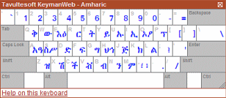

KeymanWeb's Button user interface allows multiple keyboards to be
integrated into a website and controlled through a single button
control. This button is visible all the time, and so can be incorporated
into the site's overall design.

### Using the Button Interface to Type in Your Language

### Button Control

 If the **Button Control** *(left)* is visible on a website, this is an
indication that KeymanWeb has been set up to allow typing in one or more
languages. The Button Control is usually located above, beside or close
to a text box or text area, though this will vary depending on the
design and layout of the site.

Moving the mouse point over the Menu Button will display the **Keyboard
Menu** *(left)*. This is a list of all the keyboards which have been
integrated for use with KeymanWeb on this particular website.

### Selecting a Keyboard

To choose the keyboard or language in which to type, click once on that
keyboard's name in the Keyboard Menu. The name will then be marked in
**bold** text on the menu. On many sites, you can start typing
immediately, while in other cases, you will need to click once inside
the text box or text area before beginning to type.

If a website incorporates several keyboards, it is possible to type in
more than one language inside a single text box by returning to the
Keyboard Menu and selecting a different keyboard. To return to typing in
English or your default language, simply choose 'English' from the
Keyboard Menu.

KeymanWeb will only affect the keyboard used in the text box to which it
is attached. If you type text into any other text box or text area, it
will continue to appear in your normal language.

### On-Screen Keyboard

The [On-Screen Keyboard](osk) *(left)* is a dynamic display showing the
layout of the keyboard you are using. At the top of the Keyboard Menu
(assuming the On-Screen Keyboard is not already visible) is the item
. Clicking on this once will
cause the On-Screen Keyboard to appear and change the menu item to
. This works in reverse if the
On-Screen Keyboard is already displayed.

To avoid obscuring the display, the On-Screen Keyboard will not actually
be displayed unless you have clicked in a text box which incorporates
KeymanWeb. For more information about using the On-Screen Keyboard,
[click here](osk).
