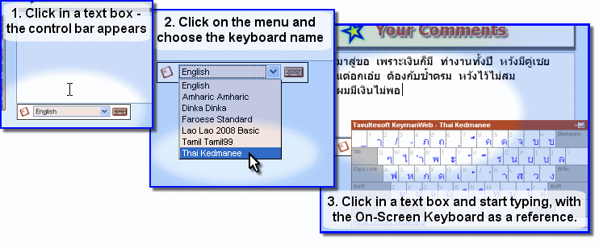
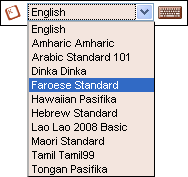
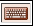

KeymanWeb's Floating user interface provides a straightforward and
unobtrusive method of incorporating a range of languages and keyboards
into a website.

### Using the Floating Interface to Type in Your Language

### Control Bar

On a website which uses this KeymanWeb interface to allow typing in one
or more languages, the **Control Bar** *(left)* will appear when you
click in a text box or text area.

The Control Bar will be located either to the right of or below the text
box, depending on how the website has been set up, and will disappear
when you click on a different part of the website.

### Selecting a Keyboard

In the centre of the Control Bar is a menu which displays a list of all
the keyboards that have been integrated into the website. To choose the
keyboard or language in which to type, click once on that keyboard's
name in the Keyboard Menu. The name will then be highlighted on the
menu, and you can start typing immediately.

If a website incorporates several keyboards, it is possible to type in
more than one language inside a single text box by returning to this
menu and selecting a different keyboard. To return to typing in English
or your default language, simply choose 'English' from the menu.

KeymanWeb will only affect the keyboard used in the text box to which it
is attached. If you type text into any other text box or text area, it
will continue to appear in your normal language.

### On-Screen Keyboard

The [On-Screen Keyboard](osk) *(left)* is a dynamic display showing the
layout of the keyboard you are using. Clicking on the On-Screen Keyboard
icon  on the right side of the Control Bar
turns the On-Screen Keyboard on and off. When the On-Screen keyboard is
activated, this icon will have a border around it, as shown. However, to
avoid obscuring the display, the On-Screen Keyboard will not actually be
displayed unless you have clicked in a text box which incorporates
KeymanWeb. For more information about using the On-Screen Keyboard,
[click here](osk).

  
