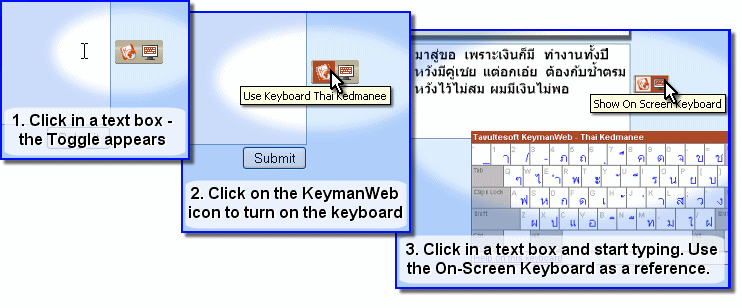
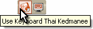

KeymanWeb's Toggle user interface is designed to provide a simple and
unobtrusive way of incorporating a single keyboard into a website.

### Using the Toggle Interface to Type in Your Language

### Toggle Control

 When you click in a text box (or text area) on the website, the **Toggle
Control** *(left)* appears on the right of the box, indicating that it
is possible to type in another language.

 Hovering the mouse pointer over the KeymanWeb icon on the left-hand side
of the Toggle control *(left)* will display the name of the language and
keyboard which has been enabled for this site. Clicking on the icon will
turn KeymanWeb on and enable you to type in this language. When
KeymanWeb is active, there will be a solid border around the KeymanWeb
icon (as in the image). To turn KeymanWeb off and return to typing in
your default language, simply click on the icon once again.

---
**Note:** Clicking in a different text box or text area will not necessarily turn KeymanWeb off; this depends on how the website has been configured.

---

### On-Screen Keyboard

The [On-Screen Keyboard](osk) *(left)* is a dynamic display showing the
layout of the keyboard you are using. Clicking on the On-Screen Keyboard
icon  on the right side of the Toggle
Control turns the On-Screen Keyboard on and off. When the On-Screen
keyboard is activated, this icon will have a solid border around it.
However, to avoid obscuring the display, the On-Screen Keyboard will not
actually be displayed unless you have clicked in a text box which
incorporates KeymanWeb. For more information about using the On-Screen
Keyboard, [click here](osk).
