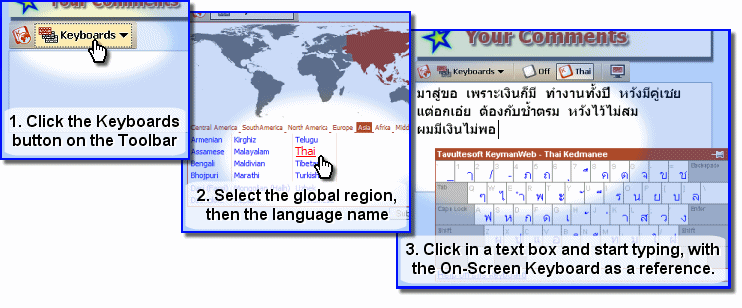
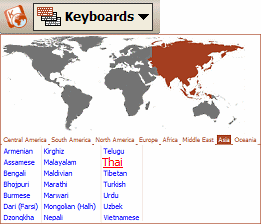
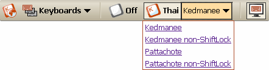
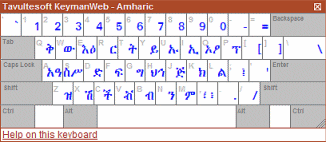
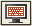

## Toolbar Interface

KeymanWeb's Toolbar user interface provides a very clear and visible
method of incorporating a range of international languages and keyboards
into a website. The toolbar is visible all the time, which makes it
suitable for incorporating into a site's overall design.

### Using the Toolbar Interface to Type in Your Language

### Toolbar

 If the **Toolbar** *(left)* is visible on a website, this is an
indication that KeymanWeb has been set up to allow typing in one or more
languages. The Toolbar is usually located above, inside or close to a
text box or text area, though this will vary, depending on the site.

### Selecting a Keyboard

To begin typing in a different language, in which to type, click on the
**Keyboards** dropdown menu on the Toolbar. A world map, divided into
regions, will be displayed, with a list of available languages below
*(right)*. Clicking on each region of the world will update the list so
show which languages from that region can be used to type. Simply click
on the name of the language you wish to use.

For languages which have only a single keyboard available, a label
giving the name of the selected language will be added to the Toolbar,
and you can click in a suitable text box or text area and begin typing
with that keyboard. To return to typing in English or your default
language, click on the  icon near the
centre of the Toolbar.

For many languages, however, a variety of keyboard layouts is available,
and more than one of these may have been incorporated into a website. In
this case, beside the language name on the Toolbar, another dropdown
menu will appear, with a list of keyboards to choose from (left). Click
on the desired keyboard and then in the text box to begin typing using
this keyboard.

If a website incorporates several keyboards, it is possible to type in
more than one language inside a single text box by returning to the
menus on the Toolbar and selecting a different language and/or keyboard.
As mentioned above, clicking on the 
icon near the centre of the Toolbar will return you to typing in English
or your default language.

### On-Screen Keyboard

The [On-Screen Keyboard](osk) *(left)* is a dynamic display showing the
layout of the keyboard you are using. Clicking on the On-Screen Keyboard
icon  on the right side of the Toolbar
turns the On-Screen Keyboard on and off. When the On-Screen keyboard is
activated, this icon will have a border around it, as shown. However, to
avoid obscuring the display, the On-Screen Keyboard will not actually be
displayed unless you have clicked in a text box which incorporates
KeymanWeb. For more information about using the On-Screen Keyboard,
[click here](osk).
