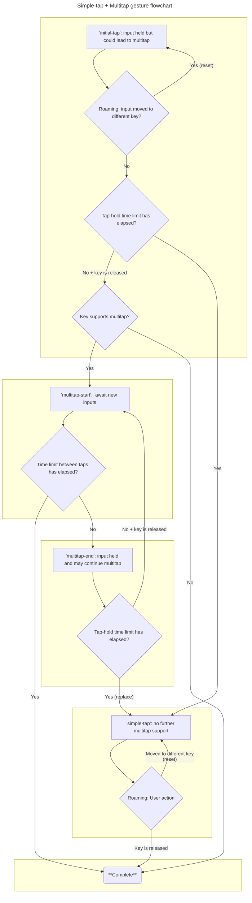
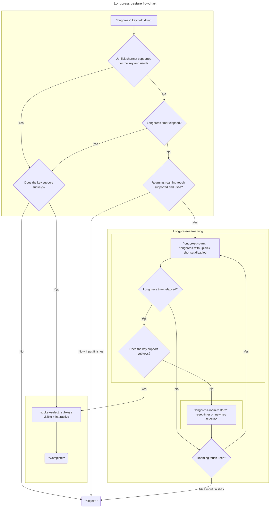
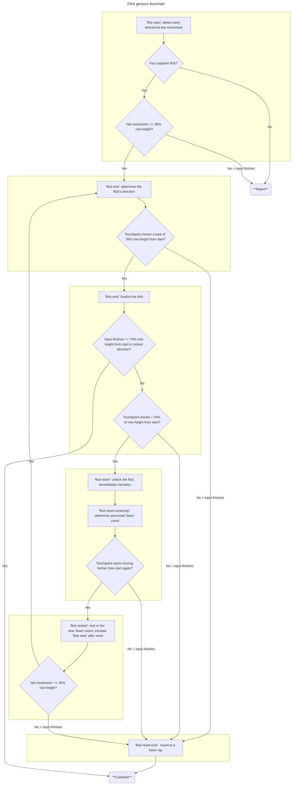

# Keyman keyboard gesture-model design

This section continues from the section on [gesture modeling](./gesture-modeling.md), elaborating on how Keyman specifies its set of gestures for use with touch-layout keyboards.

Speaking in broad strokes, Keyman Engine for Web implements its gestures via four to five gesture-component finite-state machines (FSMs).  As mentioned in the [gesture processing](./gesture-processing.md) section, each is defined independently of the others.  Whenever a FSM gesture component rejection occurs and an associated transition is triggered, processing continues for all active FSMs as usual, merely swapping out the affected FSM's active component model.  The first gesture-component to fully resolve via input match will "lock in" its FSM and disable the other FSMs for that input for all further input processing.

Furthermore, the set of active gestures will vary depending upon the properties of the active keyboard.  Keyboards that do not define flick gestures on their keys will permit "roaming touch" behaviors - these two are mutually exclusive.  The longpress and simple tap gestures have different configurations depending on whether "roaming touch" is enabled for the active keyboard.  Flick support is handled via its own dedicated FSM.

## Overview

Touch-keyboard gestures and their models are grouped together as follows:

- Special keys
  - Backspace has dedicated handling that triggers on key-down, unlike most keys.
  - The globe key (K_LOPT) and hide-keyboard key (K_ROPT) execute immediately and do not listen for further input.
  - As these are relatively simple, no FSM for them will be elaborated on here.
- Simple-taps (roaming / not roaming) and multitaps
- Longpresses (roaming / not roaming)
- Modipresses + multitap-modipresses
  - "modipress" is short for **modi**fier long**press** - using a modifier key like a longpress key, with the alternate layer as its subkey menu
- Flicks

## Simple taps and Multitaps

Multitaps function as a continuation of standard simple-tap input, so both are naturally supported in the same set of models.

Note that there are two parameters to a multitap.  These two values do not necessarily have to match.
- the maximum time a key may be held before that key is "locked in"
- the maximum time allowed between consecutive keys

When roaming-touch is disabled, the 'initial-tap' and 'simple-tap' components are replaced with alternate versions that:
- lack the outbound transition associated with change of key ('item') as defined within the `rejectionActions` property of its model.
- do not reject when the key underneath the touchpoint changes, instead remaining locked on the original key.

## Longpresses

Longpresses typically take hold once the initial key is held down a sufficient amount of time, before the key is released.  While multitaps also invoke a similar timer, that one rejects its gesture-component - an act that resets its FSM in a different state and that does not cancel the longpress FSM.  Longpresses can also trigger early via an up-flick shortcut for keys that do not also support defined flicks.

When roaming-touch is disabled, the 'longpress' component is replaced with a variant similar to the one described above for 'initial-tap' and 'simple-tap' that:
- removes outbound transitions needed to support roaming touch
- prevents any change in key under the touchpoint from affecting the gesture

## Modipresses

On their own, modipresses are not particularly difficult to model.  When seeking to support multitaps and modipresses on the same key... that's when things get trickier.  It's a relatively common paradigm for Latin-script touch-keyboards to support double-tap on Shift to reach a Caps-lock state, so it's necessary to include some form of multitap handling with the modipress FSM.  Also note that modipressible keys trigger immediately on key-down, rather than on key-up like standard taps - meaning the modipress FSM immediately disables the standard simple-tap/multitap FSM and must be defined independently from it.

In Keyman Engine for Web, we actually found a way to model the two together to yield an extra benefit - the ability to multitap and use the final "key" of the multitap as a modipress key.  This is particularly useful on keyboards like `sil_euro_latin` that support multiple layers of numbers + symbols.

```mermaid
---
title: Modipress / modipress-multitap gesture flowchart
---
%% For rendering, use e.g. https://mermaid.live
%%{init: {"flowchart": {"htmlLabels": false}} }%%
graph TD;
    start(**Start**)
    modipress-start['modipress-start': key-down detection + filtering]
    modipress-hold['modipress-hold': modipress state active]
    modipress-end['modipress-end': modipress state still active]
    modipress-end-multitap-transition['modipress-end-multitap-transition': transition to multitap mode]
    modipress-multitap-start['modipress-multitap-start': await new tap on base key]
    modipress-multitap-end['modipress-multitap-end': modipress state active]
    modipress-multitap-lock-transition['modipress-multitap-lock-transition': no further multitapping allowed]
    complete(**Complete**)
    reject(**Reject**)

    valid-multitap-key{Key supports multitap?}
    valid-modipress-check{Is the key valid for modipresses?}
    early-new-gesture{New gesture started during modipress hold?}
    hold-timer-elapsed-initial{Tap-hold time limit has elapsed?}
    await-new-timer-elapsed{Time limit between taps has elapsed?}
    late-new-gesture{New gesture started during modipress hold?}
    hold-timer-elapsed-subsequent{Tap-hold time limit has elapsed?}

    subgraph Stage1[" "]
    start --> valid-modipress-check
    end

    valid-modipress-check -- Yes --> modipress-start
    valid-modipress-check -- No  --> reject

    subgraph Stage2[" "]
    reject
    end

    subgraph Stage3[" "]
    modipress-start
    end

    modipress-start -- (emits key) --> modipress-hold

    subgraph Stage4[" "]
    modipress-hold --> early-new-gesture
    early-new-gesture -- No --> hold-timer-elapsed-initial
    end

    early-new-gesture -- Yes --> modipress-end
    hold-timer-elapsed-initial -- No + input finishes --> modipress-end-multitap-transition
    hold-timer-elapsed-initial -- Yes --> modipress-end

    subgraph Stage5[" "]
    modipress-end
    end

    modipress-end --> complete

    subgraph Stage6[" "]
    complete
    end

    subgraph MultitapSupport["Multitap support block"]
        subgraph Stage7[" "]
        modipress-end-multitap-transition
        end

        modipress-end-multitap-transition --> valid-multitap-key
        valid-multitap-key -- Yes --> modipress-multitap-start
        valid-multitap-key -- No --> complete

        modipress-multitap-start

        subgraph Stage8[" "]
        modipress-multitap-start --> await-new-timer-elapsed
        end

        await-new-timer-elapsed -- No --> modipress-multitap-end

        subgraph Stage9[" "]
        modipress-multitap-end  --> late-new-gesture
        late-new-gesture -- No --> hold-timer-elapsed-subsequent
        end

        late-new-gesture -- Yes --> modipress-multitap-lock-transition
        hold-timer-elapsed-subsequent -- Yes --> modipress-multitap-lock-transition
        hold-timer-elapsed-subsequent -- No + input finishes --> modipress-multitap-start

        subgraph Stage10[" "]
        modipress-multitap-lock-transition
        end

    end

    await-new-timer-elapsed -- Yes --> complete

    modipress-multitap-lock-transition --> modipress-end
```

Note that both `modipress-end-multitap-transition` and `modipress-multitap-lock-transition` are transitory (but real!) states that immediately transition to their successors.  They exist to abstractify and clarify the mechanisms at play.

## Flicks

The flick gesture models have their own devoted FSM in order to support their complexities.  Of particular note is that flicks and longpresses compete in a similar space, so the 'flick-start' -> 'flick-mid' transition exists to "lock in" after a small-but-significant amount of motion as a flick, rather than a longpress.  If a key is held too long without enough movement on a key supporting both flicks and longpresses, the longpress FSM will transition first and cancel any further attempt to match a flick for that input.

One less-obvious aspect of this FSM is that of the "reset" + "recentering" mechanism.  If a user attempts to "reset" the flick by returning to where they started, it is very rare that they will actually succeed in doing so.  They'll usually be off somewhat and/or base their judgment based upon the center of the key, which may not be the actual coordinate where input began.  The "recentering" mechanism seeks to address this aspect of user behavior, predicting a "center" that matches a user's intuitions better and that provides more "wiggle room" before re-activating direction locking.

Note that the early cases from 'flick-start' that lead to 'reject' are all valid inputs for gesture types handled by previously-defined FSMs.