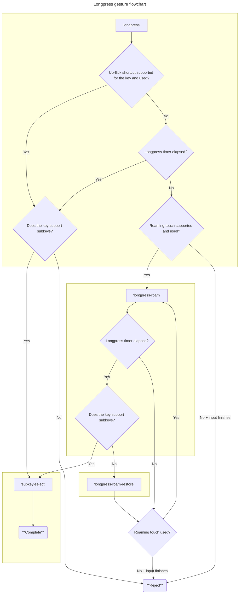
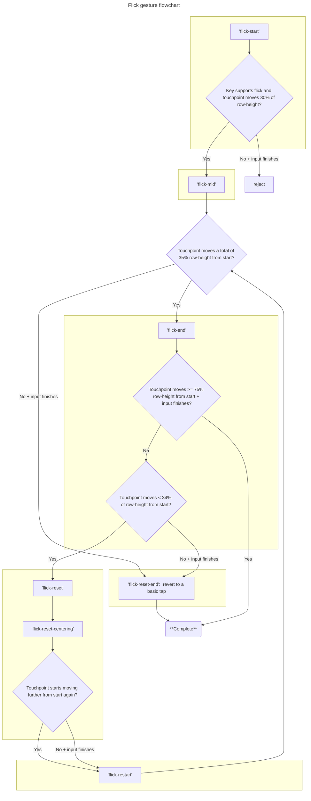
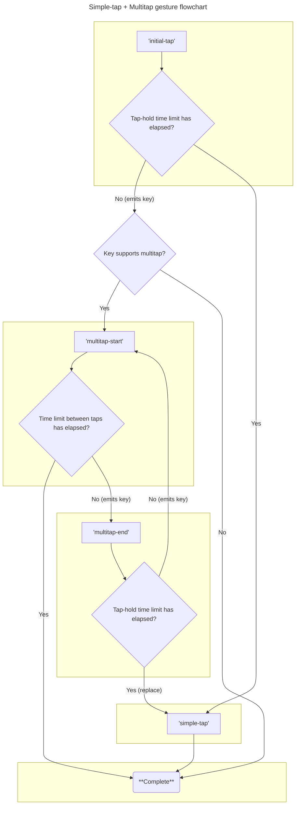
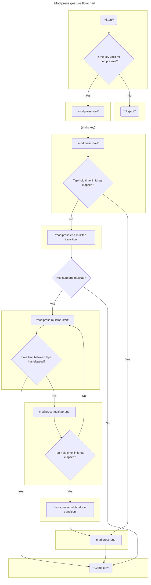

# Keyman keyboard gesture-model design

This section continues from the section on [gesture modeling](./gesture-modeling.md), elaborating on how Keyman specifies its set of gestures for use with touch-layout keyboards.

## Prototype flowcharts

### Longpress flowchart

```mermaid
---
title: Longpress gesture flowchart
---
%% For rendering, use e.g. https://mermaid.live
%%{init: {"flowchart": {"htmlLabels": false}} }%%
graph TD;
    longpress['longpress']
    subkey-select['subkey-select']
    longpress-roam['longpress-roam']
    longpress-roam-restore['longpress-roam-restore']
    reject(**Reject**)
    complete(**Complete**)

    didShortcut{Up-flick shortcut supported for the key and used?}
    didWait{Longpress timer elapsed?}
    didWait2{Longpress timer elapsed?}
    allowedRoam{Roaming-touch supported and used?}
    supportsSubkeys{Does the key support subkeys?}
    supportsSubkeys2{Does the key support subkeys?}
    didRoam{Roaming touch used?}

    subgraph Stage1[" "]
    longpress-->didShortcut
    didShortcut -- Yes --> supportsSubkeys
    didShortcut -- No  --> didWait
    didWait -- Yes --> supportsSubkeys
    didWait -- No --> allowedRoam
    end

    supportsSubkeys -- Yes --> subkey-select
    supportsSubkeys -- No --> reject

    subgraph Stage2[" "]
    subkey-select --> complete
    end

    allowedRoam -- Yes --> longpress-roam
    allowedRoam -- No + input finishes --> reject

    subgraph Stage3[" "]
    longpress-roam --> didWait2
    didWait2 -- Yes --> supportsSubkeys2
    end

    didWait2 -- No --> didRoam
    didRoam  -- Yes --> longpress-roam
    didRoam  -- No + input finishes --> reject
    supportsSubkeys2 -- Yes --> subkey-select
    supportsSubkeys2 -- No --> longpress-roam-restore

    subgraph Stage4[" "]
    longpress-roam-restore
    end

    longpress-roam-restore --> didRoam
```

### Flick flowchart

```mermaid
---
title: Flick gesture flowchart
---
%% For rendering, use e.g. https://mermaid.live
%%{init: {"flowchart": {"htmlLabels": false}} }%%
graph TD;
    flick-start['flick-start']
    flick-restart['flick-restart']
    flick-mid['flick-mid']
    flick-end['flick-end']
    flick-reset['flick-reset']
    flick-reset-centering['flick-reset-centering']
    flick-reset-end['flick-reset-end':  revert to a basic tap]
    complete(**Complete**)

    start-condition{Key supports flick and touchpoint moves 30% of row-height?}
    lock-condition{Touchpoint moves a total of 35% row-height from start?}
    unlock-condition{Touchpoint moves < 34% of row-height from start?}
    recenter-condition{Touchpoint starts moving further from start again?}
    finalize-condition{Touchpoint moves >= 75% row-height from start + input finishes?}

    subgraph Stage1[" "]
    flick-start --> start-condition
    end

    start-condition -- Yes --> flick-mid
    start-condition -- No + input finishes --> reject

    subgraph Stage2[" "]
    flick-mid
    end

    flick-mid --> lock-condition
    lock-condition -- Yes --> flick-end
    lock-condition -- No + input finishes --> flick-reset-end

    subgraph StageFail[" "]
    flick-reset-end
    end

    flick-reset-end --> complete

    subgraph Stage3[" "]
    flick-end --> finalize-condition
    finalize-condition -- No --> unlock-condition
    end

    finalize-condition -- Yes --> complete
    unlock-condition -- Yes --> flick-reset
    unlock-condition -- No + input finishes --> flick-reset-end

    subgraph Stage4[" "]
    flick-reset --> flick-reset-centering
    flick-reset-centering --> recenter-condition
    end

    recenter-condition -- Yes --> flick-restart
    recenter-condition -- No + input finishes --> flick-restart

    subgraph Stage6[" "]
    flick-restart
    end
    flick-restart --> lock-condition
```

### Simple-tap + multitap flowchart

```mermaid
---
title: Simple-tap + Multitap gesture flowchart
---
%% For rendering, use e.g. https://mermaid.live
%%{init: {"flowchart": {"htmlLabels": false}} }%%
graph TD;
    initial-tap['initial-tap']
    simple-tap['simple-tap']
    multitap-start['multitap-start']
    multitap-end['multitap-end']
    complete(**Complete**)

    hold-timer-elapsed-initial{Tap-hold time limit has elapsed?}
    valid-multitap-key{Key supports multitap?}
    await-new-timer-elapsed{Time limit between taps has elapsed?}
    hold-timer-elapsed-subsequent{Tap-hold time limit has elapsed?}

    subgraph Stage1[" "]
    initial-tap --> hold-timer-elapsed-initial
    end

    hold-timer-elapsed-initial -- No (emits key) --> valid-multitap-key
    hold-timer-elapsed-initial -- Yes --> simple-tap

    valid-multitap-key -- Yes --> multitap-start
    valid-multitap-key -- No  --> complete

    subgraph Stage2[" "]
    simple-tap
    end

    simple-tap --> complete

    subgraph Stage3[" "]
    complete
    end

    subgraph Stage4[" "]
    multitap-start --> await-new-timer-elapsed
    await-new-timer-elapsed -- Yes --> complete
    end

    await-new-timer-elapsed -- No (emits key) --> multitap-end

    subgraph Stage5[" "]
    multitap-end --> hold-timer-elapsed-subsequent
    end

    hold-timer-elapsed-subsequent -- Yes (replace) --> simple-tap
    hold-timer-elapsed-subsequent -- No (emits key) --> multitap-start
```

### Modipress flowchart

```mermaid
---
title: Modipress gesture flowchart
---
%% For rendering, use e.g. https://mermaid.live
%%{init: {"flowchart": {"htmlLabels": false}} }%%
graph TD;
    start(**Start**)
    modipress-start['modipress-start']
    modipress-hold['modipress-hold']
    modipress-end['modipress-end']
    modipress-end-multitap-transition['modipress-end-multitap-transition']
    modipress-multitap-start['modipress-multitap-start']
    modipress-multitap-end['modipress-multitap-end']
    modipress-multitap-lock-transition['modipress-multitap-lock-transition']
    complete(**Complete**)
    reject(**Reject**)

    valid-multitap-key{Key supports multitap?}
    valid-modipress-check{Is the key valid for modipresses?}
    hold-timer-elapsed-initial{Tap-hold time limit has elapsed?}
    await-new-timer-elapsed{Time limit between taps has elapsed?}
    hold-timer-elapsed-subsequent{Tap-hold time limit has elapsed?}

    subgraph Stage1[" "]
    start --> valid-modipress-check
    end

    valid-modipress-check -- Yes --> modipress-start
    valid-modipress-check -- No  --> reject

    subgraph Stage2[" "]
    reject
    end

    subgraph Stage3[" "]
    modipress-start
    end

    modipress-start -- (emits key) --> modipress-hold

    subgraph Stage4[" "]
    modipress-hold --> hold-timer-elapsed-initial
    end

    hold-timer-elapsed-initial -- No  --> modipress-end-multitap-transition
    hold-timer-elapsed-initial -- Yes --> modipress-end

    subgraph Stage5[" "]
    modipress-end
    end

    modipress-end --> complete

    subgraph Stage6[" "]
    complete
    end

    subgraph Stage7[" "]
    modipress-end-multitap-transition
    end

    modipress-end-multitap-transition --> valid-multitap-key
    valid-multitap-key -- Yes --> modipress-multitap-start
    valid-multitap-key -- No --> complete

    modipress-multitap-start

    subgraph Stage8[" "]
    modipress-multitap-start --> await-new-timer-elapsed
    end

    await-new-timer-elapsed -- Yes --> complete
    await-new-timer-elapsed -- No  --> modipress-multitap-end

    subgraph Stage9[" "]
    modipress-multitap-end  --> hold-timer-elapsed-subsequent
    end

    hold-timer-elapsed-subsequent -- Yes --> modipress-multitap-lock-transition
    hold-timer-elapsed-subsequent -- No  --> modipress-multitap-start

    subgraph Stage10[" "]
    modipress-multitap-lock-transition
    end

    modipress-multitap-lock-transition --> modipress-end
```