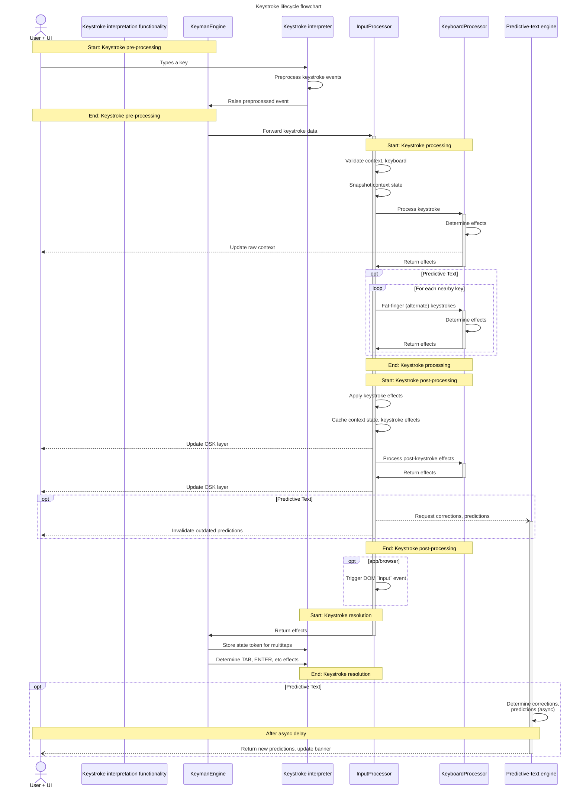

# The Keyman Engine for Web keystroke lifecycle

The phases of Keyman Engine for Web keystroke processings are as follows:

1. Keystroke pre-processing: event interception + interpretation (pre-processing)
2. Keystroke processing: keystroke main-group rule evaluation
3. Keystroke post-processing: keystroke post-keystroke evaluation + side-effects
4. Keystroke resolution: UI state updating

Keyman Engine for Web currently has two different builds, each used in specific
contexts:

* app/browser - for direct use on a page or site within a web browser
* app/webview - for integration with a host app, such as Keyman itself

The overall phases for the keystroke lifecycle are the same for both; the
implementation is merely a bit different for each within specific phases.  These
differences are documented after the common structure and patterns for each
phase.

Also note that Keyman Engine for Web supports keystroke processing for different
keyboard specification formats:
- JS
- KMX (via web-core)
- KMX+ / LDML (via web-core)

The `KeyboardProcessor` classes each handle keystroke processing for one
specification format while adhering to a common interface exposed and accessible
to the other layers of the keystroke lifecycle.

## Keystroke pre-processing

Both the `app/browser` and `app/webview` products are capable of handling
keystrokes from the on-screen keyboard as well as hardware keystrokes.  For
hardware keystrokes, this varies between the two, while the majority of
on-screen keyboard keystrokes are handled identically.

### `app/browser` - hardware keystrokes

The `app/browser` version of the engine is designed to integrate with the active
page of the user's browser.  As a result of this, contexts for text manipulation
are directly implemented within Web elements that the engine has direct access
to.  It can thus attach DOM event handlers (for
[`keydown`](https://developer.mozilla.org/en-US/docs/Web/API/Element/keydown_event),
[`keyup`](https://developer.mozilla.org/en-US/docs/Web/API/Element/keyup_event),
and
[`keypress`](https://developer.mozilla.org/en-US/docs/Web/API/Element/keypress_event))
in order to process hardware keystrokes.  Its `HardwareEventKeyboard` class is
the primary module for handling hardware keystrokes - it establishes the needed
engine event hooks and methods used to fully handle and preprocess their
keystroke data for further use later in the keystroke lifecycle.

The bulk of DOM key events trigger keystroke processing on key-down, though modifier keys also receive key-up handling.  Key-press events are handled selectively for held backspaces and possibly certain keystrokes for mnemonic keyboards.  In all cases, DOM keyboard event objects are preprocessed by the centralized `preprocessKeyboardEvent` method, which converts the DOM event [`KeyboardEvent`](https://developer.mozilla.org/en-US/docs/Web/API/KeyboardEvent) format into the Web engine's `KeyEvent` format, which is the form required by the keyboard rules within compiled JS keyboards.  This includes mnemonic keystroke preprocessing and remapping in addition to AltGr emulation.

### `app/webview` - hardware keystrokes

The `app/webview` version of the engine, which is designed to be used while embedded in a platform-specific host app, does not have direct access to standard hardware keystroke events, as those are handled by the host app's OS and by native code handlers run outside the host app's WebView containing the app/webview Web engine. It is the responsibility of the host app to handle hardware keystroke events and preprocess them on behalf of the Web engine, then forward them to the Web engine via JS call into the WebView.  The `PassthroughKeyboard` class within `app/webview` space provides the method `raiseKeyEvent` as an internal API for this purpose, which converts the mobile-app format for hardware keystroke into the internal `KeyEvent` format.  `raiseKeyEvent` also handles mnemonic keystroke processing and remapping.

Also note that this variant does not model the user's text context with Web elements - it is entirely managed through the `SyntheticTextStore` type.

### On-screen keyboard

For both `app/browser` and `app/webview`, the on-screen keyboard delegates mouse
and touch processing to [our internal gesture engine](./gestures/index.md) for
most keyboards.  (Keyboards that instead display "help pages", such as
`sil_euro_latin` on desktop, have specialized handling.)  The gesture engine is
responsible for interpreting all DOM mouse and touch events for OSKs based on
the touch-layout format, which are managed by the `VisualKeyboard` class.  The
gesture engine will raise events about the gesture lifecycle that, when
appropriate, will emit `KeyElement` instances - elements of the constructed OSK
corresponding to elements of the OSK directly representing keyboard keys.

OSK keystroke preprocessing operates a little differently from hardware
keystrokes.  The `ActiveLayout` object for the current form-factor of the
`Keyboard` maintains a "base" `KeyEvent` object, per key, that is
lazy-constructed (by the `.baseKeyEvent` property) when first needed - the meat
of which is performed by the `ActiveKeyBase.constructBaseKeyEvent` method.  This
is only evaluated up to once per key per activation of the keyboard.  As
keystrokes are received during OSK use, `VisualKeyboard.keyEventFromSpec` calls
the `Keyboard.constructKeyEvent` method to clone that base `KeyEvent` object for
the incoming keystroke and then adjust it to match current modifier and
state-key settings.

### Passing `KeyEvent` on for processing

Regardless of the path taken to generate the `KeyEvent` object, _all_ keystroke
handling modules of Keyman Engine for Web then raise that `KeyEvent` object via
their `keyevent` event as specified by the `KeyEventSourceInterface` type.  This
event also permits a callback that is used by the final phase of the lifecycle -
keystroke resolution - as needed.  The main `KeymanEngine` base class listens
for these events and forwards them for next phase of the lifecycle - keystroke
processing - to the `InputProcessor` module, which passes control to whichever
`KeystrokeProcessor` type is active for the keyboard when appropriate.

## Keystroke processing

Once the `KeyEvent` object for a keystroke has been passed into the
`InputProcessor` module and its `processKeyEvent` method, the
keystroke-processing stage has been reached.  There are a number of subprocesses
that trigger here in sequence - keystrokes don't go _straight_ to evaluation
against keyboard rules.

### Pre-keystroke state management

First, the engine checks the keyboard associated with the `KeyEvent`, ensuring
that it is still in place.  (See [#7543](https://github.com/keymanapp/keyman/issues/7543) for more details.)  With that assertion
in place, it then performs a check needed to support multitaps - it checks to
see if the key event has an associated "base context" and reverts the current
context to match it if so.  Once those checks are fulfilled, the engine then
checks to see if the key event corresponds to a pure layer-switching or
modifier/state-key interaction.  If those are detected, rule-evaluation is
bypassed.

On a similar note, backspace and spacebar keystrokes receive special handling
next in associated with predictive-text functionality.  When autocorrect is
enabled, the spacebar in particular can be used to accept the current suggestion
instead of acting as whitespace; if this is triggered, its `KeyEvent` will be
swallowed - no rule processing will occur for the it.  The backspace may trigger
display of a "reversion" suggestion when applicable but will not be swallowed.

Once this phase is reached, the engine will then snapshot the current state of
the context, then trigger standard rule processing against the original context
by calling the current `KeyboardProcessor`'s `processKeystroke` method.  Any
operations against the context will be persisted and take full effect; DOM input
elements (for `app/browser`) are updated during rule evaluation.

### Determining direct keystroke effects

The `KeyboardProcessor` classes, which each embody how one keyboard
specification pattern interprets keystrokes, are responsible for determining the
effects that should arise when evaluating the incoming keystroke with the
current context state.  While the exact mechanisms of this may vary depending
upon the type of keyboard - be it JS, KMX, or KMX+ (LDML), the role is the same
- interpreting the keystroke in context.

### JS keyboards

Before proceeding further, `KeyboardProcessor` does a context check to see
whether or not the context contains anything considered deletable - in the case
of a BKSP, we need to ensure that the keystroke passes through to the engine's
host cleanly, as it may have special implications for the site or host app.

With that out of the way, the JS keyboard's main group is then provided with the
`KeyEvent` object in order to evaluate the keyboard's rules against the
keystroke.  This involves constructing a `ProcessorAction` object to track any and
all needed side-effects for the keystroke.  Such changes are generally not
applied to the engine at large at this time in order to prevent unwanted side
effects that may arise to and from predictive text operations that follow
shortly afterward.

The `JSKeyboardInterface` class defines the internal API used by keyboards for
their evaluation of keyboard rules.

Once the keyboard's script returns control to the main engine, the engine then
determines the net effects to the context that resulted from applying the
keyboard rule and preserves that as a `Transcription`, part of includes a
`Transform` that most directly represents the changes to text surrounding the
text insertion point.

For JS keyboards, if no keyboard rule is defined for a non-frame key on the
`default` or `shift` layer, there is an additional set of implied "default"
keyboard rules that is applied.  (A keyboard's source must _explicitly_ specify
to not emit anything for such keys if such an outcome is desired.)  This occurs
regardless of the keystroke's source, as such effects are necessary to
incorporate for predictive-text operations.  If no such rule exists, the
processor will add a note to the `ProcessorAction` object that default processing
could not be provided and is thus needed from the engine's host.

### KMX keyboards & KMX+ (LDML) keyboards

For KMX and KMX+ keyboards, keystrokes are evaluated by using the embedded WASM
version of Keyman Core.

TODO: add link to specific mechanisms here once available.

### "Alternate" processing (predictive-text)

Once the incoming `KeyEvent` has been processed, if predictive-text is active
and the `KeyEvent` includes fat-finger oriented data, the engine will then build
a set of "alternates" - of "phantom" keystrokes - and process _them_ against
headless clones of the original context in the same manner as the original
keystroke.

Once all relevant "alternates" have been evaluated, the engine will then signal
the predictive-text engine with all relevant data, including the original,
snapshotted state of the context.  It does not actually trigger predictive-text
at this time; processing of alternates is done before keystroke post-processing
in order to avoid cross-effects from JS-keyboard variable store manipulations
and similar mechanisms.  Fat-finger "alternate" `KeyEvent`s are evaluated as if
they occurred under the exact same conditions as the keystroke that was actually
detected.

### Keystroke post-processing

At this stage, the side-effects desired for the original keystroke, as saved to
its `ProcessorAction`, are then applied.  Note that this includes changes to the
`&layer` store - this update will also trigger an event that updates the state
of the OSK to match the desired layer.

Once that is done, the engine will then save data relevant to the original
context state, the `KeyEvent`, and the `ProcessorAction` to the "context cache"
supporting multitap context reversion.  These effects include layer-change
effects that result from JS keyboard rules, which modify the KMN-style keyboard
stores `&oldlayer` and `&newlayer` in preparation for `begin PostKeystroke`
group processing, which is then executed (and which can trigger another `&layer`
& OSK-layer update).

Once post-keystroke effects have been determined, the engine then signals
predictive-text to generate new predictions associated with the keystroke.  For
`app/browser` variants of the engine, changes to the context will then also
trigger the DOM `input` event on the context's element in case third parties
wish to leverage such events for their website's pages.

### Keystroke resolution

At this stage, `InputProcessor` passes control back to the main `KeymanEngine`
module, which then triggers the "on rule finalization" setting if configured.
This setting is mostly used for page-integration within `app/browser`,
supporting DOM element `change` event emulation whenever focus shifts away from
the active context element.

For OSK keystrokes, an identifier associated with the `KeyEvent`'s context
snapshot will be made accessible through the `keyevent` event's callback
parameter - a feature utilized by multitap gesture support.

For hardware-keyboard keystrokes, the `keyevent` callback is used to determine
whether or not native handling for the keystroke should be triggered - such as
for TAB and ENTER keys, which may have semantic command-like functionality
depending on the state of the Web engine's host - be that a web page or an
Android/iOS app utilizing the keyboard.  ENTER keys are often used to submit
forms, and this helps ensure we trigger such functionality when appropriate.
