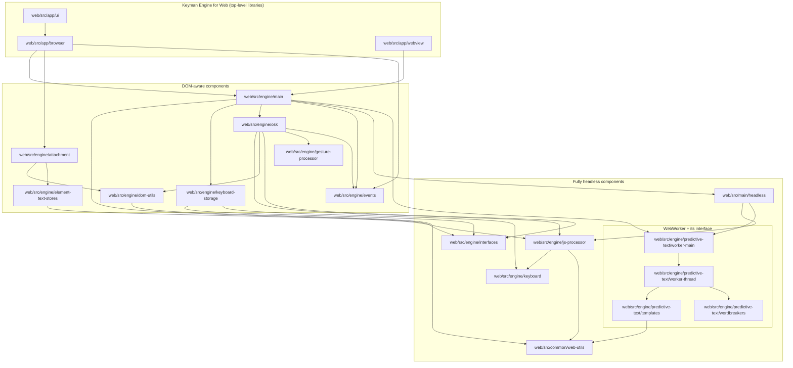

```mermaid
graph TD;
    Keyboards[web/src/engine/keyboard];
    Gestures[web/src/engine/gesture-processor];
    OSK[web/src/engine/osk];
    KP["web/src/engine/js-processor"];
    KP-->Keyboards;
    IP["web/src/main/headless"];
    OSK-->KP;
    IP-->KP;
    Utils["web/src/common/web-utils"];
    KP---->Utils;
    Wordbreakers["web/src/engine/predictive-text/wordbreakers"];
    Models["web/src/engine/predictive-text/templates"];
    Models-->Utils;
    LMWorker["web/src/engine/predictive-text/worker-thread"];
    LMWorker-->Models;
    LMWorker-->Wordbreakers;
    LMLayer["web/src/engine/predictive-text/worker-main"];
    LMLayer-->LMWorker;
    IP-->LMLayer;

    subgraph PredText["WebWorker + its interface"]
        LMLayer;
        LMWorker;
        Models;
        Wordbreakers;
    end

    subgraph Headless["Fully headless components"]
        direction LR
        Keyboards;
        KP;
        IP;
        Utils;
        PredText;
        Configuration[web/src/engine/interfaces];
    end

    subgraph ClassicWeb["DOM-aware components"]
        Events[web/src/engine/events];
        Elements[web/src/engine/element-text-stores];
        Elements-->KP;
        KeyboardCache[web/src/engine/keyboard-storage];
        KeyboardCache-->Configuration;
        KeyboardCache--->Keyboards;
        DomUtils[web/src/engine/dom-utils];
        DomUtils-->Utils;
        OSK-->DomUtils;
        OSK---->Configuration;
        OSK-->Gestures;
        OSK--->Events;
        CommonEngine[web/src/engine/main];
        CommonEngine-->Configuration;
        CommonEngine-->KeyboardCache;
        CommonEngine-->OSK;
        CommonEngine--->Events;
        CommonEngine---->IP;
        CommonEngine--->LMLayer;
        Attachment[web/src/engine/attachment];
        Attachment-->DomUtils;
        Attachment-->Elements;
    end

    subgraph WebEngine["Keyman Engine for Web (top-level libraries)"]
        Browser[web/src/app/browser];
        WebView[web/src/app/webview];
        UIModules["web/src/app/ui"];

        WebView--->CommonEngine;

        Browser--->CommonEngine;
        Browser-->Attachment;
        Browser---->Events;

        UIModules-->Browser;
    end
```