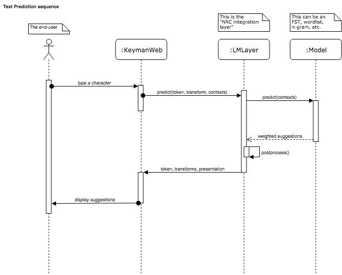
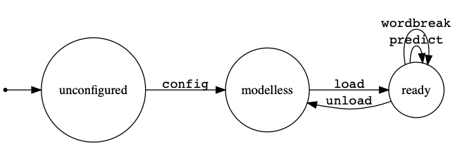

Keyman/Language Modelling layer 
================================

This document introduces the protocol for communicating between
KeymanWeb and the language modeling layer (i.e., the configurable
prediction and suggestion engine, (henceforth referred to as the
"LMLayer").

Note: I'm using the term **keyboard** as a synonym for **KeymanWeb**.

>  The key words "MUST", "MUST NOT", "REQUIRED", "SHALL", "SHALL
>  NOT", "SHOULD", "SHOULD NOT", "RECOMMENDED",  "MAY", and
>  "OPTIONAL" in this document are to be interpreted as described in
>  [RFC 2119].

[RFC 2119]: https://www.ietf.org/rfc/rfc2119.txt


Communication protocol between keyboard and asynchronous worker
---------------------------------------------------------------



We have decided that everything to the right of the `KeymanWeb` will be
in a Web Worker. However, communication can happen only through
[`postMessage(data)`][postMessage] commands,
where `data` is a serializable object (via the [structured clone][]
algorithm).

What serializable object can we send that will adhere to the [open-closed principle]?

### Messages

The idea is to use a [discriminated union][]. The protocol involves
plain JavaScript objects with one property called `message` that takes
a finite set of `string` values.

These string values indicate what message should be sent. The rest of
the properties in the object are the parameters send with the message.

```javascript
{
    message: 'predict',
    // message-specific properties here
}
```

See also: [XML-RPC][]

Messages are **not** methods. That is, there is no assumption that
a client will receive a reply when a message is sent. However, some
pairs of messages, such as `predict` and `suggestions`, assume
(non-blocking!) request/response semantics.

[discriminated union]: http://www.typescriptlang.org/docs/handbook/advanced-types.html#discriminated-unions
[open-closed principle]: https://en.wikipedia.org/wiki/Open%E2%80%93closed_principle
[XML-RPC]: https://en.wikipedia.org/wiki/XML-RPC
[structured clone]: https://developer.mozilla.org/en-US/docs/Web/API/Web_Workers_API/Structured_clone_algorithm
[postMessage]: https://developer.mozilla.org/en-US/docs/Web/API/Worker/postMessage


### Tokens

Tokens uniquely identify an input event, such as a key press. Since
Keyman should ask for an asynchronous prediction on most key presses, the
token is intended to associate a prediction and its response with
a particular input; Keyman is free to ignore prediction responses if
they are for outdated input events.

The `Token` type is opaque to LMLayer. That is, LMLayer does not inspect
its contents; it simply uses it to identify a request and pass it back
to Keyman. There are a few requirements on the concrete type of the
`Token`:

 1. Tokens **MUST** be serializable via the [structured clone][] algorithm;
 2. Tokens **MUST** be usable as a key in a [`Map`][Map object] object.
 3. Tokens **MUST** be unique across messages. That is, tokens **MUST
    NOT** be duplicated between different messages.

It is up to the keyboard to create unambiguous tokens that can be uniquely
identified through the round-trip process.

In the following examples, I'll use the subset of `number` values that
are interpretable as [31-bit signed integers][Smi].

[Map object]: https://developer.mozilla.org/en-US/docs/Web/JavaScript/Reference/Global_Objects/Map#Key_equality
[Smi]: https://github.com/thlorenz/v8-perf/blob/master/data-types.md#efficiently-representing-values-and-tagging
[Tokens]: #tokens

### Example

An asynchronous message to predict after typing 'D':

```javascript
{
    message: 'predict',

    token: 1,
    transform: {
        insert: 'D',
        deleteLeft: 0,
        deleteRight: 0
    },
    context: {
      left: '',
      right: '',
      startOfBuffer: true,
      endOfBuffer: true
    },
}
```

Message types
-------------

Currently there are a whole bunch of message types:

Message         | Direction          | Parameters          | Expected reply      | Uses token
----------------|--------------------|---------------------|---------------------|---------------
`config`        | LMLayer → worker   | capabilities        | No                  | No
`load`          | keyboard → LMLayer | model               | Yes — `ready`       | No
`unload`        | keyboard → LMLayer | none                | No                  | No 
`ready`         | LMLayer → keyboard | configuration       | No                  | No
`predict`       | keyboard → LMLayer | transform, context  | Yes — `suggestions` | Yes
`suggestions`   | LMLayer → keyboard | suggestions         | No                  | Yes
`wordbreak`     | LMLayer → worker   | context             | Yes - `currentword` | Yes
`currentword`   | LMLayer → keyboard | string              | No                  | Yes
`accept`        | keyboard → LMLayer | suggestion,         | Yes - `postaccept`  | Yes
                                     | context, transform  |                     |
`postaccept`    | LMLayer → keyboard | reversion           | No                  | Yes
`revert`        | keyboard → LMLayer | reversion, context  | Yes - `reversion`   | Yes
`postrevert`    | LMLayer → keyboard | suggestions         | No                  | Yes
`reset-context` | keyboard → LMLayer | context             | No                  | No
              

### Message: `config`

Must be sent from the keyboard to the LMLayer so that the LMLayer
may properly configure loaded models. It will send `config`, a plain
JavaScript object specifying platform restrictions.

The keyboard **MUST NOT** send any messages to the LMLayer prior to sending `config`.
After this, it is safe to assume the `config` was performed successfully and is ready to
`load` a model.

The LMLayer needs to know the platform's abilities and restrictions (capabilities).

```typescript
interface ConfigMessage {
  message: 'load';

  /**
   * The path to the model's compiled script file.
   */
  capabilities: {
    /**
     * The maximum amount of UTF-16 code points that the keyboard will provide to
     * the left of the cursor, as an integer.
     */
    maxLeftContextCodePoints: number,

    /**
     * The maximum amount of code points that the keyboard will provide to the
     * right of the cursor, as an integer. The value 0 or the absence of this
     * rule implies that the right contexts are not supported.
     */
    maxRightContextCodePoints?: number,

    /**
     * Whether the platform supports deleting to the right. The absence of this
     * rule implies false.
     */
    supportsDeleteRight?: false,
  }
}
```

### Message: `load`

Must be sent from the keyboard to the LMLayer so that the LMLayer
loads a model. It will send `load` which is a plain
JavaScript object specify the path to the model, as well configurations
and platform restrictions.

After a single `config` message, the keyboard **MUST NOT** send any messages 
to the LMLayer prior to sending `load`. The keyboard **SHOULD NOT** send another 
message to the keyboard until it receives `ready` message from the LMLayer
before sending another message.

The LMLayer needs to know which concrete language model to instantiate. This is provided
by the file at the path specified by the `model` string parameter.

```typescript
interface LoadMessage {
  message: 'load';

  /**
   * The path to the model's compiled script file.
   */
  model: string
}
```

### Message: `unload`

Must be sent from the keyboard to the LMLayer so that the LMLayer
resets itself in preparation for loading a new model. It will send `unload`
which is a plain message to trigger release of old model resources.


```typescript
interface UnloadMessage {
  message: 'unload';
}
```


### Message: `ready`

Must be sent from the LMLayer to the keyboard when the LMLayer's model
as a response to `load`. It will send `configuration`, which is
a plain JavaScript object requesting configuration from the keyboard.

There are only two options defined so far:

```typescript
interface ReadyMessage {
  message: 'ready';
  configuration: {
    /**
     * How many UTF-16 code points maximum to send as the context to the
     * left of the cursor ("left" in the Unicode character stream).
     *
     * Affects the `context` property sent in `predict` messages.
     *
     * While the left context MUST NOT bisect surrogate pairs, they MAY
     * bisect graphical clusters.
     */
    leftContextCodePoints: number,

    /**
     * How many UTF-16 code points maximum to send as the context to the
     * right of the cursor ("right" in the Unicode character stream).
     *
     * Affects the `context` property sent in `predict` messages.
     *
     * While the left context MUST NOT bisect surrogate pairs, they MAY
     * bisect graphical clusters.
     */
    rightContextCodePoints: number,

    /**
     * Whether or not the model appends characters to Suggestions for
     * wordbreaking purposes.  (These characters need not be whitespace
     * or actual wordbreak characters.)
     */
    wordbreaksAfterSuggestions: boolean
  };
}
```


### Message: `predict`

Sent from the keyboard to the LMLayer whenever a new prediction should
be generated. This is typically initiated by a key press event. The
keyboard **SHOULD** track each `predict` message using a [token][Tokens]. The
token **MUST** be unique across all prediction events. The LMLayer
**SHOULD** respond to each `predict` message with a `suggestions`
message. The `suggestions` message **MUST** contain the corresponding
token as sent in the initial `predict` message.

The keyboard **MUST** send the `context` parameter. The keyboard
**SHOULD** send the `transform` parameter. The keyboard **MUST** send
a unique token.

The semantics of the `predict` message **MUST** be from the
perspective of this sequence of events:

 1. After the input event is received by the keyboard.
 2. Before the keyboard applies the associated `transform` to the buffer.

**NOTE**: The keyboard **MAY** apply the `transform` associated with the
input event before receiving the corresponding `suggestions` message
from the LMLayer. The intention is that once the suggestions are displayed,
the typist may select one of the suggestions in the place of the effects
of their original input.

**NOTE**: The keyboard **MAY** send the `predict` message after it has
applied the `transform` associated with the input event to the buffer.
Regardless of the actual sequence, the semantics **MUST** remain the
same: the prediction happens from the perspective before the `transform`
has been applied. Therefore, if the keyboard eagerly transforms the
buffer before it has sent the `predict` message, it must anticipate
_undoing_ the `transform` it has already applied should it apply a
`transfrom` sent in the `suggestions` message. The keyboard must act
as if it has never applied the `transform` associated with the input
event in the first place.

#### Context

The context is the text surrounding the insertion point, _before_ the
transform is applied to the buffer.

```typescript
interface Context {
  /**
   * Up to maxLeftContextCodePoints code points of Unicode scalar value
   * (i. e., characters) to the left of the insertion point in the
   * buffer. If there is nothing to the left of the buffer, this returns
   * an empty string.
   */
  left: USVString;

  /**
   * Up to maxRightContextCodePoints code points of Unicode scalar value
   * (i. e., characters) to the right of the insertion point in the
   * buffer. If there is nothing to the right of the buffer, this returns
   * an empty string.
   */
  right?: USVString;

  /**
   * Whether the insertion point is at the start of the buffer.
   */
  startOfBuffer: boolean;

  /**
   * Whether the insertion point is at the end of the buffer.
   */
  endOfBuffer: boolean;
}
```

[Context]: #context

#### Transform

The transform parameter describes how the input event will change the
buffer.

```typescript
interface Transform {
  /**
   * The Unicode scalar values (i.e., characters) to be inserted at the
   * cursor position.
   *
   * Corresponds to `s` in com.keyman.KeyboardInterface.output.
   */
  insert: USVString;

  /**
   * The number of code points to delete to the left of the cursor.
   *
   * Corresponds to `dn` in com.keyman.KeyboardInterface.output.
   */
  deleteLeft: number;

  /**
   * The number of code points to delete to the right of the cursor.
   * Not available on all platforms.
   */
  deleteRight?: number;
}
```

[Transform]: #transform

### Message: `suggestions`

The `suggestions` message is sent from the LMLayer to the keyboard. This
message sends a ranked array of suggestions, in descending order of
probability (i.e., entry `0` is most likely, followed by entry `1`,
etc.). This message **MUST** be in response to a `predict` message, and
it **MUST** respond with the corresponding [token][Tokens].

```typescript
/**
 * `suggestions` is an ordered array of suggestion objects.
 * Each suggestion is a transform bundled with a `displayAs` property.
 */
let suggestions = Suggestion[];

interface Suggestion {
  /**
   * Same object as an input event transform.
   * Note that the transform is applied AFTER the input event
   * transform.
   */
  transform: Transform;
  /**
   * A string to display the suggestion to the typist.
   * This should aid the typist understand what the transform
   * will do to their text.
   */
  displayAs: string;
}
```

```javascript
let suggestions = [
  {
    transform: {
      insert: 'teapot',
      deleteLeft: 1,
      deleteRight: 0
    },
    displayAs: '🍵'
  }
];
```


#### Timing

Each suggestion provides a `transform`. This [transform][Transform] is applied
_after_ the transform associated with the input event that initiated
this prediction. That is, the suggested transform applies to the buffer
after the transform associated with the input event.

Rephrased in somewhat mathematical terms:
Let 𝑥 ∈ 𝐵 be the input text buffer. Let 𝑇<sub>𝑖</sub> be the transform
associated with an input event that maps a text buffer 𝐵 → 𝐵. Let
𝑇<sub>𝑠</sub> be a transform suggested through the LMLayer. 𝑦 ∈ 𝐵 is the
text buffer after the suggestion transform has been applied.  The
correct sequence of applications should be as follows:

> 𝑦 = 𝑇<sub>𝑠</sub>(𝑇<sub>𝑖</sub>(𝑥))


#### Late suggestions

Sometimes, a `suggestions` message may arrive after an input event has
already invalidated its request. This is called a **"late" suggestion**.
The LMLayer **MAY** send late suggestions. Consequently, the keyboard
**MAY** discard the late suggestions. There is no requirement for the
keyboard to acknowledge late suggestions, or for the LMLayer to avoid
sending late `suggestions` messages. In either case, a `suggestions`
message can be identified as appropriate or "late" via its `token`
property.


### Message: `wordbreak`

Sent from the keyboard to the LMLayer to request a wordbreak operation
on the current [context][Context] for use in its UI operations.  (One useful
example:  display text for a 'reversion' suggestion that undoes
previously-applied suggestions.)  The keyboard **SHOULD** track each
`wordbreak` message using a [token][Tokens].  The token **MUST** be unique
across all wordbreak events.  The LMLayer **SHOULD** respond to each
`wordbreak` message with a `currentword` message.  The `wordbreak`
message **MUST** contain the corresponding token as sent in the initial
`wordbreak` message.

The keyboard **MUST** send the `context` parameter.  The keyboard **MUST**
send a unique token.

The semantics of the `wordbreak` message **MUST** be from the perspective
of this sequence of events:

1. After any pending UI operations are completed, including application
of any selected suggestion's `transform` to the `context`.
2. Before the user inputs any additional keystrokes.

### Message: `currentword`

The `currentword` message is sent from the LMLayer to the keyboard.  This
message sends the single word (as determined by wordbreaking) from
within context that begins to the left of the insertion point but
following the last wordbreaking character(s) to the left of the insertion
point.  If no such wordform exists, this returns an empty string.

This message **MUST** be in response to a `wordbreak` message, and it
**MUST** respond with the corresponding [token][Tokens].

### Message: `accept`

The `accept` message is sent from the keyboard to the LMLayer.  This
message tells the LMLayer that a previously-returned `suggestion` 
(from a `predict`-`suggestions` pair) has been accepted by the user.  
The LMLayer **SHOULD** respond to each `accept` message with a 
`postaccept` message providing a `reversion` capable of undoing it.

The keyboard **MUST** send the `suggestion` and `context` parameters.
The keyboard **MUST** send a unique token.  The `postTransform` parameter is 
optional, but highly suggested.

The semantics of the `accept` message **MUST** be from the perspective
of this sequence of events:

1. A user has just selected the `suggestion` as valid.
2. The keystroke triggering the `suggestion` has NOT been committed to 
   the `context`.  Its Transform data is sent as the `postTransform`
   parameter.  (The "post" nomenclature component signifies that 
   `postTransform` comes temporally "after" this context state.)
3. Before the user inputs any additional keystrokes, which would trigger
   new suggestions.

The `postTransform` parameter allows the base keystroke, which has **NOT**
been applied to the provided `context`, to be restored by the `reversion` 
that undoes acceptance of the `suggestion`.  

For reference, compare this to the ["Message: `predict`" section](#message-predict)
For Suggestions returned by a `predict`->`suggestions` message sequence:

* `predict`'s `context` there should match `context` here.
* `predict`'s `transform` there should match `postTransform` here.
    - In the case that a distribution of Transforms was specified, rather than 
    just one, only the 'base' keystroke's Transform should be used.

These serve as a snapshot in time of the state in which the Suggestion was
generated.

### Message: `postaccept`

The `postaccept` message is sent from the LMLayer to the keyboard.  This
message sends a `reversion` capable of undoing acceptance of the `suggestion`
just accepted by the triggering `accept` message.

This message **MUST** be in response to a `postaccept` message, and it
**MUST** respond with the corresponding [token][Tokens].

### Message: `revert`

The `revert` message is sent from the keyboard to the LMLayer.

The keyboard **MUST** send a `reversion` - the one previously returned by a
`postaccept` message in response to an `accept` message.  This message tells
the predictive text engine to _revert_ the engine's tracked context to the
original `context` parameter sent as part of that `accept` message.

The keyboard must also send the _current_ `context` state, as it can be used
to determine the original context should the predictive engine have lost track
of the original state in the meantime.

### Message: `postrevert`

The `postrevert` message is sent from the LMLayer to the keyboard.  This
message sends an array of `suggestions` corresponding to the newly-restored
`context` requested by the `revert` message.

### Message: `reset-context`

The `reset-context` message is sent from the keyboard to the LMLayer.  This
message sends information on the new `context` to be used for prediction,
telling the predictive engine to disregard all previously-tracked information
that is context-dependent.

#### Examples

```javascript
{
    message: 'wordbreak',

    token: 1,
    context: {
      left: 'The quick brown fox jumped',
      right: ' over the lazy dog',
      startOfBuffer: true,
      endOfBuffer: true
    },
}
```

would result in the following reply message:

```javascript
{
    message: 'wordbreak',

    token: 1,
    word: 'jumped'
}
```

Alternatively, if the insertion point is after the space... 

```javascript
{
    message: 'wordbreak',

    token: 1,
    context: {
      left: 'The quick brown fox jumped ',
      right: 'over the lazy dog',
      startOfBuffer: true,
      endOfBuffer: true
    },
}
```

would result in the following reply message:

```javascript
{
    message: 'wordbreak',

    token: 1,
    word: ''
}
```

The latter example returns empty string as the final pre-insertion point
word preceeds the final pre-insertion point wordbreaking character.

#### Late responses

Sometimes, a `currentword` message may arrive after an input event or 
other UI interaction has already invalidated its request.  The LMLayer
**MAY** send **late** results.  Consequently, the keyboard **MAY** discard 
the late wordbreaking `currentword` result.  This is no requirement for
the keyboard to acknowledge late wordbreaking results, or for the LMLayer
to avoid sending such late messages.  In either case, a `currentword` message
can be identified as appropriate or "late" via its `token` property.

## *Informative*: LMLayer worker as a state machine

The LMLayer worker can be seen in the following states:

 - `unconfigured`
 - `model-less`
 - `ready`

The transitions of this diagram correspond to messages as described
above.


