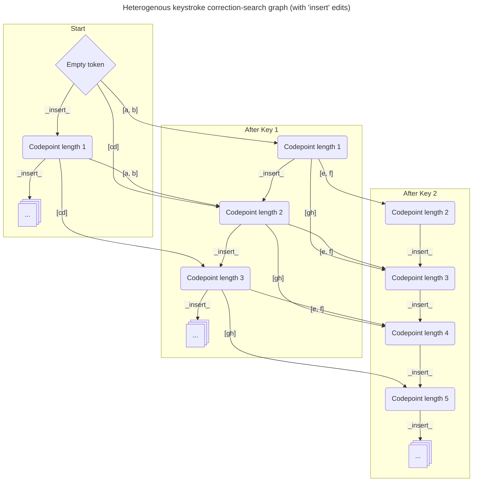
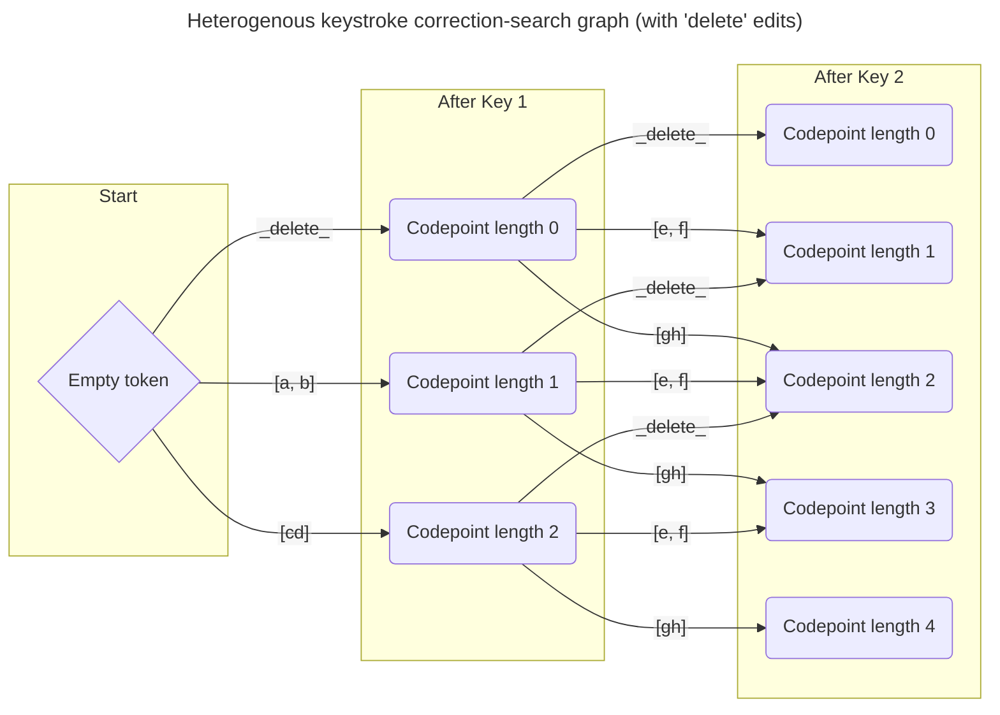

# Correction-Search as Graph Path-Finding

The Keyman predictive-text correction-search process is designed to consider all
of the most-likely possible input corrections when suggesting words from the
active lexical-model.  To do so, it dynamically builds portions of the search
graph as needed to generate corrections to the most recent token in the context.
This token lies immediately before the caret.

There is one major, notable simplifying assumption in the current
text-correction design:  we assume that each keystroke's `Transform` is 100%
independent from the `Transform` selected for every other keystroke.  This
assumption is, of course, invalid: the output of keystroke A may selectively
establish the context needed for a Keyman keyboard rule matched by one or more
keys in keystroke B.  Efforts to address this limitation are considered
out-of-scope at this time and will be addressed later in a future epic -
epic/true-correction - documented as issue #14709.

## Graph Structure

### The Root Node

When viewed at low level, the correction-search process generally takes on the
form of a search tree.  There is a single, common root node, with no input
received or processed.  The root node of the correction-search dynamic graph
represents the empty token ``.

### Edges:  Edits and Keystrokes

Each possible corrective-edit and/or keystroke replacement edit acts as an
directed edge connecting an existing path (or the root node) to a node pairing
one potential edit sequence for correctable keystrokes to valid correction
targets found within the active lexical model data source.

As each incoming keystroke may provide fat-finger alternative output
`Transform`s, each such `Transform` represents a group of edges on the search graph,
outbound from each node representing a possible accumulation of prior input.

Suppose two keystrokes have been received for a word:
- Keystroke 1 may output any of `['a', 'e', 'i']`.
- Keystroke 2 may output any of `['t', 'n']`.

For such a case, without loss of generality, there are three separate edges
corresponding to keystroke 2's `t` output:
- `'a' + 't'` => a node representing `'at'`
- `'e' + 't'` => a node representing `'et'`
- `'i' + 't'` => a node representing `'it`'
  - A similar three exist for the `n` output.

### Resulting Graph Properties

In formal graph language, we should first note the following properties:
- The graph is directed:  all keystrokes and edits happen in a specific ordering
- The graph is acyclic:  there is no way to revisit a node more than once.
    - Even _if_ text deletions occurred that restored the text itself to match
      an earlier state, the new node would represent the additional keystrokes
      and thus not match the corresponding earlier node.
- The graph may not be, strictly speaking, a tree.
    - It is possible for the net result of two or more paths through the graph to
      produce the same text output from the same set of keystrokes.
      - The different paths may incur different costs.
    - To be a tree requires that each node may only be connected to the root via
      a single path.

### Important Node Properties

1.  As future incoming `Transform`s may include `.deleteLeft` components, it is
important to note the represented codepoint length of the prefix.

-  It does not make sense to represent a node of negative length.  Should this
   result, we should throw away the token and start editing its predecessor
   instead.
-  A node of zero length may be considered to "throw away" and replace the
   corresponding context token with a new empty token.

2.  As the whole point of correction-search is to generate valid corrections for
the text, it is important to remember the range of input represented by any
generated correction.

- When the represented range matches that of the range represented by the
current active context text, corrections may be applied safely without
side-effects.

- Should the represented range differ from the range represented by the current
active context text, corrections to other tokens may be required; we do not wish
to either forget or to duplicate portions of the user's input.

    - E.g:  if a whitespace typo occurs mid-word, the user's expected correction
      might need to correct the current token, the whitespace's token, and the
      prior piece of the word into a single token.
    - The range for correction is determined by comparing the active context
      token ranges with that of the correction's source, which may have never
      added the wordbreak.

3.  For the purposes of correction-search, we do not need separate nodes to
distinguish between two different correction paths that result in the same net
effects... so long as the text results from the same applied user-input range.
What matters is that _a_ valid path to the correction exists.  See ["Overlapping
Subproblems"](#overlapping-subproblems) below for further implications of this.

## Correction-Search and Dynamic Programming

With a few tweaks and restrictions, we can use dynamic programming techniques to
facilitate our correction-search processes.  First, note the assumption stated
earlier:

> [...] we assume that each keystroke's `Transform` is 100% independent from the
`Transform` selected for every other keystroke.

Therefore, we can find the cost of selecting a correction by using a
[divide-and-conquer
strategy](https://en.wikipedia.org/wiki/Divide-and-conquer_algorithm) for the
correction-search path:

1.  Find the cost of the path to which the incoming edit or keystroke
    `Transform` will apply.
2.  Modify by the cost of correcting the current keystroke with the specified
    `Transform` or applying a keystroke-level edit.

### Optimal Substructure

Let us examine the effects of adding different types of keystroke edits to the
correction-search path.

When adding an `insert` edit, we do not add data for an additional keystroke.
Instead, we look more deeply into the lexicon based on the current path's
prefix, extending the 'match' dimension of the search path with a cost penalty.
Thus, cost will only _increase_ for `insert` edit operations.

When adding a `delete` edit, we do add data for an additional keystroke, but opt
not to include its `Transform` whatsoever.  This extends the 'input' dimension
of the search path, paying a cost penality to do so.  Thus, cost will only
_increase_ for `delete` edit operations.

When adding a `match` or `substitute` edit without specified left-deletions, we
add data for an additional keystroke, including a corresponding `Transform`
while also looking more deeply into the lexicon in a manner that matches the
input.  For this case, no cost penalty is incurred for the 'match' component
when for `match` edits, though one _is_ applied for `substitute` edits.  A small
cost penalty corresponding to the selected `Transform`'s probability is applied
either way.  **So long** as the applied 'input' `Transform` has no specified
left-deletions, the total cost will remain flat or increase - it will not
decrease.  Both the 'input' and 'match' dimensions of the search path are
extended by `match` and `substitute` edit operations.

#### Optimal Substructure with Deletes

When adding a `match` or `substitute` edit **with** specified left-deletions, it
is possible for a naive implementation to perform a reduction in total cost.
Deleting portions of the 'input' (and corresponding sections of the 'match'
dimension) will reduce the path to a simpler state - and generally speaking, to
one of lower cost. This is the sole case that may currently invalidate the
[dynamic programming requirement of "optimal
substructure"](https://en.wikipedia.org/wiki/Dynamic_programming#Computer_science).
(See #14366.)  With further time investment, we should be able to develop and
implement a strategy to meet the conditions for optimal substructure even for
such cases.

### Overlapping Subproblems

Looking at the correction-search graph naively, one may think that
correction-search can be fully handled by a divide-and-conquer approach.  This
is sadly not the case; it is possible to reach the same intermediate node (see
point 3 under ["Important Node Properties"](#important-node-properties)) via
multiple paths.

Consider the following case:
- Keystroke 1: produces a distribution with inserts ['t', 'th']
- Keystroke 2: produces a distribution with inserts ['he', 'e']

Taking the first insert from each keystroke yields 'the', which matches the
result of taking the second insert from each.  This yields two different paths
to the same node:
- Text: `the`
- Text length: 3
- Built from the same portions of the same keystrokes - just different 'samples'.

Any further correction prefixes built from either node don't care _which_ node
is the parent; the extended prefix will be built in exactly the same way, with
exactly the same increase in path cost.

From a probabilistic / statistics standpoint, the true "correct" thing to do
would be to sum up all occurrences of "the same" node, resulting in a
higher-probability mass (and thus, a lower cost path to the singleton version of
the node).  However, this is difficult to do computationally during an optimized
search.  There is always the chance that another unreached variant of the path
exists.

As we wish to find the highest probability (lowest cost) paths (correction
prefixes) and return them quickly and efficiently, a greedy approach - one in
which we _don't_ attempt to accumulate node probabilities - makes the process
far simpler - and _also_ meets the condition for [dynamic programming's
"overlapping subproblems"
constraint](https://en.wikipedia.org/wiki/Dynamic_programming#Computer_science).
When iterating through nodes from lowest-cost to highest cost, once any path to
a valid correction prefix is found, we can return it immediately.

# The Dynamic Search-Graph

In the sections above, the following mappings have been established:
- Prefixes for text correction/prediction can be mapped to graph nodes.
- Specific `Transform`s (from incoming keystroke `Transform` distributions) can
  be mapped to graph edges.
- `insert` and `delete` edits can _also_ be mapped to graph edges.

As established in the sections above, individual graph nodes uniquely represent
possible prefixes for text-corrections for specific input ranges.
- Once a lowest-cost path to a prefix has been found, we disregard other,
  higher-cost paths that also arrive there.
- The same prefix may be supported by a different node when the portion of input
  the second node represents differs.

We have also established that the paths we obtain for valid corrections via
pathfinding on the search graph have overlapping subproblems and exhibit optimal
substructure (currently, with caveats).  As a result, we can use dynamic
programming techniques to optimize correction-search.  Once the [delete-left
issue](#optimal-substructure-with-deletes) is resolved, the caveats will
disappear, providing a truly optimal solution.

The use of dynamic programming, along with the mappings and properties
established above, will win us the following benefits:
- The results of a correction-search may be _directly_ reused for future
  searches after a new keystroke is added to the same correction-search space as
  existing, pre-solved subproblems of the extended correction-search space.
- Keystrokes will always be processed - and processed in the same order they
  were received.
    - They may be "processed" via a `delete` edit.

## Graph Topology

Let us now more thoroughly examine the properties of valid search paths on the correction-search graph.

Once a search path on the correction-search graph reaches a node, extensions of that path will never return to any of the following:
- the destination node's ancestors
- to nodes corresponding to any other `Transform` from keystrokes already
  processed
- to nodes corresponding to edits applied before any keystrokes already
  processed

In formal graph language, we can use these properties to define subsets of nodes
as graph
[_modules_](https://en.wikipedia.org/wiki/Modular_decomposition#Modules).  We
can then use these modules to define [quotient
graphs](https://en.wikipedia.org/wiki/Quotient_graph) for the correction-search
graph's nodes and edges in order to better clarify its structure.

<!-- Mermaid flowcharts + graphs!  Also, "subgraph". -->

### Keystroke-Based Modules

Let us start with a simplified case - one without 'insert' or 'delete' edits.
Instead, the only edges result from correcting keystrokes and matching them
against the lexicon.

For a first example, suppose we have the following scenario:
- Keystroke 1:  outputs one of the following:
    - `{insert: 'a', deleteLeft: 0}`
    - `{insert: 'b', deleteLeft: 0}`
- Keystroke 2:  outputs one of the following:
    - `{insert: 'c', deleteLeft: 0}`
    - `{insert: 'd', deleteLeft: 0}`
- Keystroke 3:  outputs one of the following:
    - `{insert: 'e', deleteLeft: 0}`
    - `{insert: 'f', deleteLeft: 0}`

Assuming that all possible combinations are valid prefixes, correction-search's
graph would then expand as follows:

The figure above represents a [**quotient
graph**](https://en.wikipedia.org/wiki/Quotient_graph) of the search space for
this example case.
-  Note how there is a clear ordering of events and how the correction-search
process goes through exactly four nodes in this scenario - the only point of
differentiation is _which four_.
- We know correction-search will go through up to one node from each column for
any path, and _exactly_ one for any completed path.

Furthermore, each _column_ represents a [**modular
partition**](https://en.wikipedia.org/wiki/Modular_decomposition#Modular_quotients_and_factors)
of the graph.
- Each column, then, represents a graph
  [**module**](https://en.wikipedia.org/wiki/Modular_decomposition#Modules)
  while also being a partition of the graph.
- Note that for every node on the graph not in a module (column), each other
  node _either_ connects to _all_ of that module's nodes or to _none_ of them.

The graph can thus be condensed as follows:

### Handling Complex Transforms

Let us now examine a case with a bit more complexity.  Suppose we have the
following scenario:
- Keystroke 1:  outputs one of the following:
    - `{insert: 'a', deleteLeft: 0}`
    - `{insert: 'b', deleteLeft: 0}`
    - `{insert: 'cd', deleteLeft: 0}`
- Keystroke 2:  outputs one of the following:
    - `{insert: 'e', deleteLeft: 0}`
    - `{insert: 'f', deleteLeft: 0}`
    - `{insert: 'gh', deleteLeft: 0}`
- Keystroke 3:  outputs one of the following:
    - `{insert: 'i', deleteLeft: 0}`
    - `{insert: 'jk', deleteLeft: 0}`
    - `{insert: 'l', deleteLeft: 1}`

Assuming that all possible combinations are valid prefixes, correction-search's
graph would then expand as follows:

In its condensed view, we get...

Note that this graph _itself_ has an implied modular partition, with modules for
each keystroke containing submodules for each codepoint length resulting from
following the search path through to that node.

We maintain the graph in this manner in order to properly handle left-deletions
for all cases. Should a later left-deletion erase _all_ of the search path's
codepoint length, or worse - go negative - there will be special handling
required.  For cases where the left-deletions exceed currently-modeled codepoint
length, the most straightforward model for excess left-deletions is to edit and
correct text that lands before the caret after the final left-deletion is
applied.

### Placing Edit Operations

`insert` edits increase the codepoint length of the represented path, but do not
include data from extra keystrokes.  Thus, the search-graph with `insert` edits,
for the first two keys, may be visualized as follows:

<!-- TODO - PR enforcing this model - it doesn't actually match reality at present; the 'present' form is an error. -->

`delete` edits increase the range of represented keystrokes, but do not increase
the codepoint length of resulting suggestions.  Thus, the search-graph with
`delete` edits, for the first two keys, may be visualized as follows:

<!-- TODO - everything after this point. -->

# Correction-Search Implementation

## The `SearchNode` Class

The `SearchNode` class of the predictive-text engine represents one traversed path.

- graph does not actually build nodes
  - we keep 'em virtual
- SearchNode:
  - traverses the path
  - also represents the current path tail node / state
  - helps resolve the "overlapping subproblems" aspect

## The `SearchSpace` type

Represents one of the modules defined above (codepoint length + keystrokes
represented)

Shift module definitions:  now define modules for "from root through to
keystroke K with codepoint length N"

## The `SearchPath` type

Represents the search-graph subspace corresponding to a single inbound quotient
graph path to a single quotient graph module
- "inbound path" = single parent quotient-graph module (optimal subproblem) to
  the destination quotient-graph module

## The `SearchCluster` type

Represents the search-graph subspace corresponding to ALL inbound paths to a
single quotient graph module

Is a superset of SearchPath.