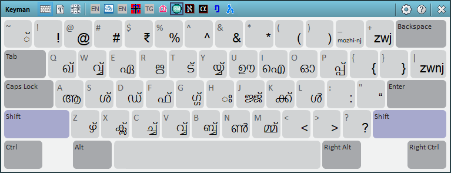

Thank you for installing Keyman. Whether you're a new or returning user,
we believe you will appreciate the significant enhancements in this
latest version of Keyman.

## What is Keyman?

Keyman is a keyboard application that makes it easy for you to type in
your language in all your favourite Windows programs and across the Web.
Keyman is used by more than a million people to type in over 2000
languages and counting.

Keyman remaps your hardware keyboard to any one of hundreds of virtual
keyboards, available for download from the
[Keyman Website](https://keyman.com/keyboards) and around the Web. If
you cannot find a suitable keyboard for your language, the companion
application [Keyman Developer](https://keyman.com/developer/) is a
powerful software solution for creating the perfect Keyman keyboard to
suit your needs.

Keyman is completely free and open source. Development of Keyman is
supported by your donations and volunteers.
[Please get involved!](https://keyman.com/about/get-involved)

Keyman features seamless integration with your Windows operating system.
You can use Keyman keyboards with Keyman in almost any Windows or
Web application. Try it in office software like Word or Excel; browsers
like Chrome, Firefox, or Edge; design programs like Adobe InDesign; and
email services like Windows Mail, Outlook, or Gmail.

Keyman fully supports [Unicode](https://www.unicode.org/) and can be
used with all standard hardware keyboards, making it the perfect
solution for typing in any language on your computer.

A list of new features in Keyman is available [here](whatsnew).

## Related Topics

-   [What's New](whatsnew)
-   [System Requirements](requirements)
