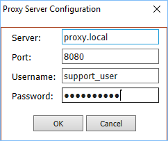

The Proxy Configuration dialog allows you to enter HTTP proxy details
for Keyman Configuration.

Most users do not need to change their proxy configuration. Proxy
configuration is used only in networked environments, and if a proxy
server is present, your network administrator will be able to provide
you with the details required.

Proxy details are used when checking for updates online and when
downloading a keyboard layout. If no proxy details are entered, Keyman
Configuration will use the proxy settings from Windows.

## Related Topics

-   [How To - Download and Install a Keyman Keyboard](../start/download-and-install-keyboard)
-   [Software Task - Update Keyman](../basic/update)
