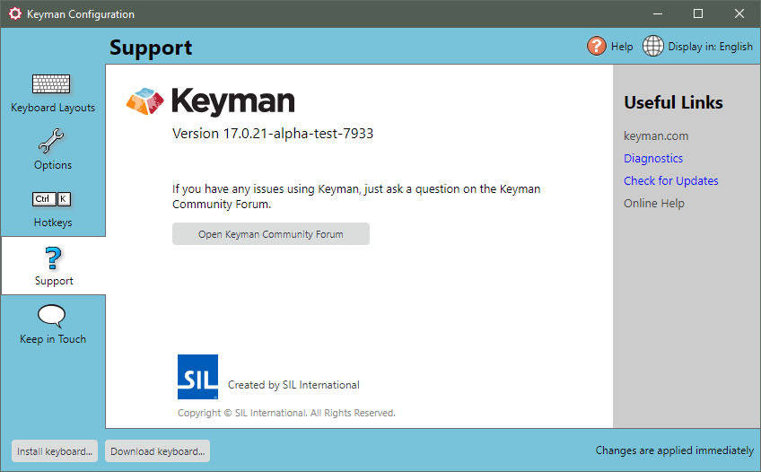

Keyman Configuration is the central control panel for Keyman. Use Keyman
Configuration to install and uninstall keyboards, change options, set
hotkeys, disable addins, associate languages, check for updates,
switch the language of Keyman user interface, and run support diagnostics.

## Opening Keyman Configuration

To open Keyman Configuration:

1.  Click on the Keyman icon , on the
    Windows Taskbar near the clock.

2.  From the Keyman menu, select **Configuration...**.

## Using Keyman Configuration

For more information on using Keyman Configuration, see:

-   [How To - Set the Language for Keyman Menus](../../start/locale)
-   [Keyman Configuration - Keyboard Layouts Tab](keyboards)
-   [Keyman Configuration - Options Tab](options)
-   [Keyman Configuration - Hotkeys Tab](hotkeys)
-   [Keyman Configuration - Support Tab](support)
-   [Keyman Configuration - Keep in Touch Tab](keep-in-touch)
