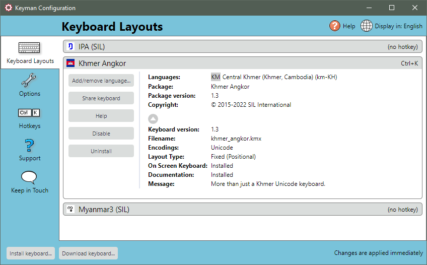

The Keyboard Layouts tab of Keyman Configuration lists all the Keyman
keyboards which are currently installed on your computer. You can use
the Keyboard Layouts tab to install and uninstall keyboards, enable and
disable keyboards, set keyboard hotkeys, show keyboard help and view
keyboard details.

## Opening the Keyboard Layouts Tab

To open the Keyboard Layouts tab of Keyman Configuration:

1.  Click on the Keyman icon , on the
    Windows Taskbar near the clock.

2.  From the Keyman menu, select Configuration....

3.  Select the Keyboard Layouts tab.

    **Tip:**
    Keyman Configuration opens in the same tab you last closed it in.

## Installing a Keyboard

To install a keyboard layout in Keyman, see: [Installing a Keyman Keyboard within Keyman](../../start/download-and-install-keyboard)

## Uninstalling a Keyboard

To uninstall a Keyman keyboard from the Keyboard Layouts tab of Keyman
Configuration, see: [Keyboard Task - Uninstall a Keyboard](../uninstall-keyboard)

## Enabling and Disabling a Keyboard

To enable or disable a Keyman keyboard from the Keyboard Layouts tab of
Keyman Configuration, see: [Keyboard Task - Enable or Disable a Keyboard](../enable-or-disable-keyboard)

## Setting a Hotkey

The Hotkey for selecting a keyboard will appear to the right of the keyboard name.
If the keyboard has more than one language associated with it then the hotkey will
appear beside the language in the keyboards details list.

1.  Click the hotkey link beside the keyboard or language. The
    Change Hotkey dialog box will be displayed.

    

2.  Select a default hotkey or click Custom and type the hotkey you wish
    to use.

    **Note:** If you press a single letter or Shift plus a single letter, the
    hotkey will default to <kbd>Ctrl</kbd> + <kbd>Alt</kbd> plus the letter you pressed, in
    order to avoid conflicts with standard keyboard input.

    **Note:** To clear a hotkey that has been set previously, click Clear Hotkey
    or press Backspace.

    **Note:** Be aware that you can set the hotkey to replace common Windows hotkeys (
    <kbd>Ctrl</kbd> + <kbd>C</kbd>, <kbd>Ctrl</kbd> + <kbd>V</kbd>, etc). This is not
    recommended.

3.  Click OK to save your selection.

The new hotkey will now be available.

The hotkeys can also be set for a Keyman keyboard, using the [Hotkeys tab](hotkeys).

## Showing Introductory Help

To show introductory help for a Keyman keyboard from the Keyboard
Layouts tab of Keyman Configuration:

1.  Select the keyboard name from the keyboard list to expand options associated with it.

2.  Click on the help button and the help documentation will be shown.
    

## Viewing Keyboard Details

To view details for a Keyman keyboard from the Keyboard Layouts tab of
Keyman Configuration:

1.  Find a keyboard in the keyboard list.

2.  Select the keyboard name from the keyboard list to expand options associated with it.
    The keyboard information window will expand.
    
    The initial drop down has the following information if available:

      -   Languages associated with the keyboard
      -   Keyboard package name
      -   Keyboard package version number
      -   Copyright details

3. Click on the down arrow
    , at the end of the list will reveal
    further details including:

    -   Keyboard version number
    -   Keyboard filename.
    -   Keyboard included fonts
    -   Keyboard encodings
    -   Keyboard layout type
    -   On Screen Keyboard status
    -   Documentation status
    -   Keyboard Message

  

## Sharing a keyboard with other users and devices

If you installed a keyboard layout using the Download keyboard button,
then you can share the keyboard with other devices and users using a QR
Code.

1.  Expand the keyboard details for the keyboard you wish to share, and
    click the Share keyboard button.

2.  A popup will appear with a QR Code. This QR Code can be scanned with
    a mobile phone camera to automatically open a web page with a
    download link to install the keyboard.

    

## Associating a keyboard with a Windows language

All Keyman keyboards are associated with a Windows language by default.
To change the association, or add a new association, see the following:

-   [How To - Set up Your Computer for a Keyman Keyboard](../../start/configure-computer)

## Related Topics

-   [Keyman Configuration](../config/)
