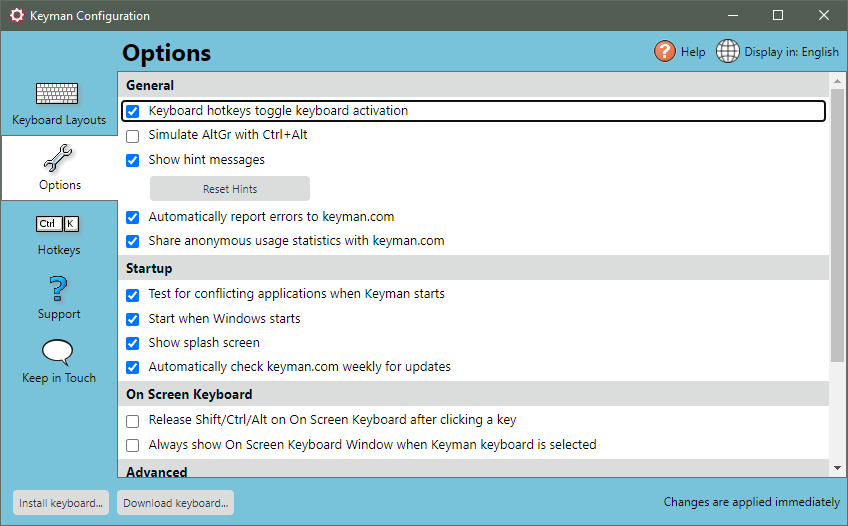
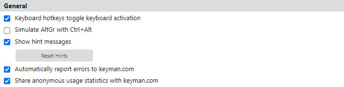
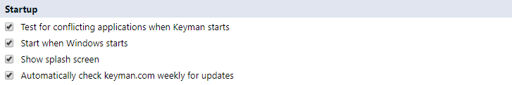
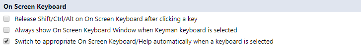
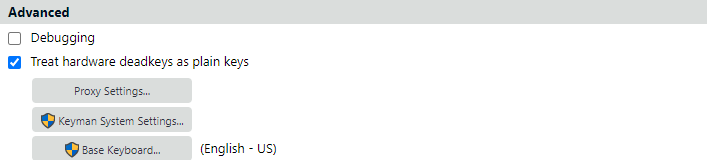

The Options tab of Keyman Configuration includes the Keyman application
options. You can use the Options tab to set general, startup, Keyman
Toolbox On Screen Keyboard and advanced options.

## Opening the Options Tab

To open the Options tab of Keyman Configuration:

1.  Click on the Keyman icon , on the
    Windows Taskbar near the clock.

2.  From the Keyman menu, select Configuration....

3.  Select the Options tab.

    **Tip:**
    Keyman Configuration opens in the same tab you last closed it in.

## Using General Options

-   Keyboard hotkeys toggle keyboard activation

    You can set unique hotkeys for quick access to any Keyman keyboard.
    Tick this option to allow a Keyman keyboard hotkey to toggle a
    keyboard on and off. Untick this option and a Keyman keyboard hotkey
    will only turn the Keyman keyboard on.

    **Tip:**
    Set hotkeys in the Hotkeys tab of Keyman Configuration.

-   Simulate AltGr with Ctrl+Alt

    Some hardware keyboards do not have a designated <kbd>AltGr</kbd> key
    (<kbd>Right Alt</kbd> key). Some Keyman keyboards require
    <kbd>AltGr</kbd>. Tick this option to allow <kbd>Ctrl</kbd> +
    <kbd>Alt</kbd> to be used for <kbd>AltGr</kbd>. Untick this option
    and <kbd>Ctrl</kbd> + <kbd>Alt</kbd> will not be used for
    <kbd>AltGr</kbd>.

-   Show hint messages

    You can turn on and off the beginner hint messages which appear
    while using Keyman. Tick this option to show all hint messages.
    Untick this option to hide all hint messages.

    **Note:**
    You can also hide hint messages on a case-by-case basis by ticking
    at the bottom of each hint.

-   Reset Hints

    Click the Reset Hints button to switch all hint messages on again,
    even those that you have switched off on a case-by-case basis.

-   Automatically report errors to keyman.com

    If Keyman crashes, then it can automatically send a report to the
    development team. This report is anonymous and contains only
    technical details relating to the crash. It does not include
    keystroke data or personally identifying data.

-   Share anonymous usage statistics with keyman.com

    In order to understand how users engage with different parts of
    the Keyman program, anonymous usage statistics may be periodically
    sent to keyman.com. These statistics do not include keystroke data
    or any personally identifying data. If you would prefer not to
    share these statistics, uncheck this box.

    **Note:** In Keyman 16.0, no statistics are currently sent,
    although the infrastructure is in place.

## Using Startup Options

-   Test for conflicting applications when Keyman starts

    Some applications are not written according to the Windows software
    development standards and can cause problems with Keyman keyboard
    input. Tick this option to have Keyman detect problem applications
    and attempt to work around them.

-   Start when Windows starts

    You can have Keyman start when you login to Windows. Tick this
    option to have Keyman start automatically after you have logged in.
    When you use this option, Keyman will not show its startup screen.
    If you untick this option, you can start Keyman yourself from the
    Start Menu.

-   Show splash screen

    You can turn on and off the Keyman startup screen that appears when
    Keyman starts. Tick this option to show the startup screen when
    Keyman is started. Note that the startup screen will not show when
    Keyman is started automatically with Windows.

-   Automatically check keyman.com weekly for updates.

    Keyman can automatically check for application and keyboard updates
    once a week. No personally identifiable information is sent to
    Keyman in this process. Tick this option to have Keyman
    automatically check weekly for updates to Keyman and the keyboards
    you have installed. Untick this option to check for updates
    manually.

    **Note:**
    Keyman can be updated manually through the Support tab in the
    Configuration menu.

## Using On Screen Keyboard Options

-   Release Shift/Ctrl/Alt on On Screen Keyboard after clicking a key

    By default, the On Screen Keyboard of the Keyman Toolbox uses
    \'sticky\' <kbd>Ctrl</kbd>, <kbd>Shift</kbd> or <kbd>Alt</kbd>
    keys. This means <kbd>Ctrl</kbd>, <kbd>Shift</kbd> and <kbd>Alt</kbd>
    stay down on the On Screen Keyboard until they are clicked again or
    until you press the actual keys on your hardware keyboard. Tick this
    option to release these keys after any key is clicked on the
    On Screen Keyboard.

-   Always show On Screen Keyboard Window when Keyman keyboard is
    selected

    You can have the On Screen Keyboard view of the Keyman Toolbox
    automatically display whenever you turn on a Keyman keyboard. Tick
    this option to have the On Screen Keyboard view for your keyboard
    automatically display. Untick this option to prevent this behaviour.

-   Switch to appropriate On Screen Keyboard/Help automatically when a
    keyboard is selected

## Using Advanced Options

-   Debugging

    If you are having issues with Keyman, you can create a debug log for
    Keyman. A debug log contains information to help Keyman Technical
    Support resolve compatibility issues and improve Keyman. Tick this
    option to begin a debug log. You should not need to use this option
    unless you are requested to do so by Keyman Technical Support in
    relation to an issue you are experiencing.

    The debug log files are created in %LOCALAPPDATA%\\Keyman\\Diag, and
    called system\#.etl, where \# is a number from 0 to 15. Each time
    you start Keyman, a new log file will be created, up to
    system15.etl, after which it will wrap around and start again at
    system0.etl. Untick this option to stop collecting a debug log.

    Debug log files will be sent to Keyman Technical Support when you
    send a diagnostic report to us with the Keyman System Information
    tool.

    Debug log files are in binary format and can be imported into
    Windows Performance Analyzer for viewing.

    **Note:**
    It is highly recommended that you switch off this option after
    obtaining the debug log. The log files can grow very large very
    quickly!

    **Warning:**
    Privacy Warning - The debug log records every keystroke you type,
    even if a Keyman keyboard is not active. This includes logins and
    passwords! For this reason, we recommend only switching the debug
    log on for short and isolated tests as specifically requested by
    Keyman Technical Support.

## Related Topics

-   [Keyman Configuration](../config/)
-   [Hotkeys tab](hotkeys)
