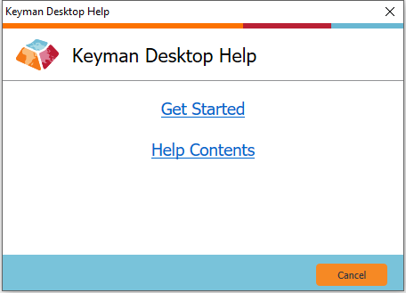

The Keyman Help menu gives you comprehensive help for every aspect of
Keyman.

**Tip:** All of the help available through the Keyman Help menu is also available online through the Help Documentation section of the [Keyman help site](https://help.keyman.com).

## Opening Help

To open Keyman Help:

1.  Click on the Keyman icon , on the
    Windows Taskbar near the clock.

2.  From the Keyman menu, select Help….

3.  Select Help Contents.

    

## Using Help

Keyman Help is divided into seven sections:

1.  About Keyman — Provides general information and licensing details
    about the current version of Keyman.

2.  Getting Started — Includes all the help you need to start using
    Keyman quickly.

3.  Basic Help — Gives a detailed overview of all of the basic features
    of Keyman.

4.  Advanced Help — Gives an overview of more advanced Keyman features.

5.  Common Questions — Includes a selection of the most frequently asked
    questions.

6.  Troubleshooting Index — Provides reference guides for specific
    issues.

7.  Context Help — Links context-sensitive help (accesible throughout
    Keyman using F1) to the correct help topics.

## Related Topics

-   [Getting Started with Keyman](../start/tutorial)
