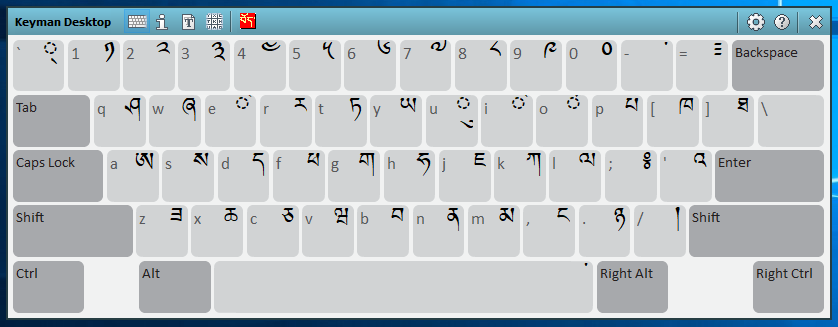
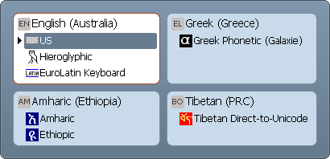

Here are five simple ways to turn on a Keyman keyboard.

**Note:**
To use a Keyman keyboard, the keyboard must be enabled in the Keyboard
Layouts tab of Keyman Configuration. For help enabling your keyboard,
see [Keyboard Task - Enable or Disable a Keyboard](enable-or-disable-keyboard).

## Turning on a Keyboard from the Keyman Menu

To turn on a keyboard from the Keyman menu:

1.  Open an application to type in, like MS Word.

    **Note:**
    You should open an application before you select a Keyman keyboard,
    depending on your Windows settings.

2.  Start Keyman.

3.  Click on the Keyman icon , on the
    Windows Taskbar near the clock.

    

4.  Select your Keyman keyboard from the list. You will notice the
    Keyman menu icon change to the icon of your Keyman keyboard. This
    means your Keyman keyboard is on.

## Turning on a Keyboard from the Keyman Toolbox

To turn on a keyboard from the Keyman Toolbox:

1.  Open an application to type in, like MS Word.

2.  Start Keyman.

3.  Click on the Keyman icon , on the
    Windows Taskbar near the clock.

    

4.  Click to open the On Screen Keyboard view of the Keyman Toolbox.

    

5.  Click to select your Keyman keyboard from the toolbar of the Keyman
    Toolbox. You will notice the Keyman menu icon change to the icon of
    your Keyman keyboard. This means your Keyman keyboard is on.

## Turning on a Keyboard from the Language Switcher

Here's how to turn on a keyboard using the Language Switcher:

1.  Open an application to type in, like MS Word.

2.  Start Keyman.

3.  Press the Language Switcher hotkey to bring up the Language
    Switcher. If you are using the default Language Switcher hotkey
    (<kbd>Left Alt</kbd> + <kbd>Shift</kbd>) or another hotkey with
    <kbd>Alt</kbd>, you will need to press and HOLD the <kbd>Alt</kbd>
    part of the hotkey and press and RELEASE the
    last key in the hotkey to use the Language Switcher. When you
    release <kbd>Alt</kbd>, the Language Switcher will close.

    **Note:**
    By default, the Language Switcher hotkey is <kbd>Left Alt</kbd> +
    <kbd>Shift</kbd>. You can view or change the current Language Switcher
    hotkey from the [Hotkeys tab](config/hotkeys) of Keyman Configuration.

    

4.  Navigate the Language Switcher using the arrow keys or by pressing
    Shift to select your Keyman keyboard.

5.  Release the Language Switcher hotkey or press <kbd>Enter</kbd> to
    activate the selected keyboard and close the Language Switcher. You
    will notice the Keyman menu icon change to the icon of your Keyman
    keyboard. This means your Keyman keyboard is on.

## Turning on a Keyboard with a Hotkey

To turn on a keyboard from the Keyman menu:

1.  Open an application to type in, like MS Word.

2.  Start Keyman.

3.  Press and release the hotkey for your Keyman keyboard.

    **Note:**
    You can find the current hotkey for your keyboard in the Keyman
    menu. You can set or reset a hotkey for your keyboard from the
    Hotkeys tab of Keyman Configuration.

    

4.  You will notice the Keyman menu icon change to the icon of your
    Keyman keyboard. This means your Keyman keyboard is on.

## Turning on a Keyboard by switching Windows languages

Because Keyman keyboards are always associated with a Windows language,
you can also switch Keyman keyboards using the Windows language switcher,
located near the clock in the Taskbar. The default hotkey for the Windows
language switcher is <kbd>Win</kbd> + <kbd>spacebar</kbd>. Hold the
<kbd>Win</kbd> key and press <kbd>spacebar</kbd> repeatedly until you
reach the desired keyboard, then release <kbd>spacebar</kbd>.

## Related Topics

-   [The Keyman Menu](tray-menu)
-   [The Keyman Toolbox](toolbox/index)
-   [Language Switcher](language-switcher)
-   [Keyman Configuration - Hotkeys Tab](config/hotkeys)
-   [Keyman Configuration - Keyboard Layouts Tab](config/keyboards)
-   [How To - Download and Install a Keyman Keyboard](../start/download-and-install-keyboard)
-   [Keyboard Task - Enable or Disable a Keyboard](enable-or-disable-keyboard)
