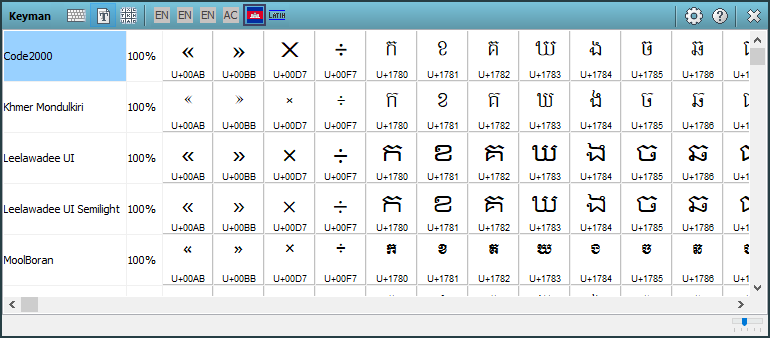

The Font Helper tool in the [Keyman Toolbox](../toolbox/) identifies
fonts on your system that should work with the currently selected
keyboard layout.

## Opening the Font Helper

To open the Font Helper:

1.  Click on the Keyman icon , on the
    Windows Taskbar near the clock.

2.  From the Keyman menu, select Font Helper.

## Using the Font Helper

To use the Font Helper:

1.  Turn on a Keyman keyboard.

2.  Open the Font Helper.

Each font listed in the Font Helper includes a percentage value. This
value indicates how many characters in the current Keyman keyboard are
available from the font. Most of the time, fonts with greater than 90%
coverage will work for nearly all texts.

In addition to percentage values, Keyman also includes a complete
Character Chart with all the keyboard characters supported by the font.
The Character Chart will allow you to see exactly which characters your
font supports. It will also allow you to see how the same characters
look in different fonts.

**Tip:**
If no fonts are listed in the Font Helper, check the documentation of
the keyboard layout to see if it includes information on where to obtain
the fonts you need.

## Related Topics

-   [The Keyman Toolbox](../toolbox/)
-   [Keyboard Task - Turn on a Keyboard](../select-keyboard)
