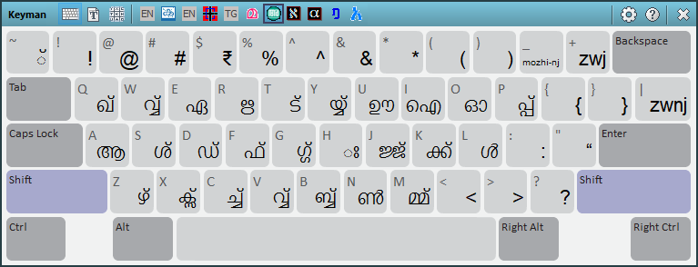
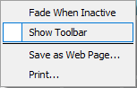

The Keyman Toolbox contains a collection of tools for working with
Keyman.

## Opening the Keyman Toolbox

To display the Keyman Toolbox:

1.  Click on the Keyman icon , on the
    Windows Taskbar near the clock.

2.  From the Keyman menu, select On Screen Keyboard.

**Note:**
The Keyman Toolbox is displayed by default in the last position it was
used. It will be displayed initially in the bottom right hand corner of
the screen.

**Note:**
The Keyman Toolbox opens automatically when you select a Keyman keyboard
layout. You can change this behaviour in the Options tab of Keyman Configuration.

## Using the Keyman Toolbox

Along the top of the Keyman Toolbox is a toolbar.

Any of the following buttons may appear in the toolbar:

| Icon | Button Name         | Description                                |
|---|---------------------|--------------------------------------------|
|  | View On Screen Keyboard     | Opens the [On Screen Keyboard](osk) for the currently selected Keyman keyboard or Windows layout.
|  | View Font Helper    | Opens the [Font Helper](font-helper) for the selected Keyman keyboard.
|  | View Character Map  | Opens the [Keyman Character Map](character-map).
|  | Open Keyman Configuration | Opens [Keyman  Configuration](../config/), where you can install or uninstall keyboard layouts and change various Keyman options and settings.
|  | Open Help | Opens [Keyman Help](../help).
|  | Close Keyman Toolbox | Closes the Keyman Toolbox but does not exit Keyman. The Keyman Toolbox can be displayed again by following the instructions at the top of this help topic.

You can move the Keyman Toolbox around your screen by clicking and
dragging anywhere on the Keyman Toolbox toolbar not covered by a button.

You can resize the Keyman Toolbox by clicking and dragging on a corner
of the Keyman Toolbox.

**Note:**
When the On Screen Keyboard tool is selected, the Keyman Toolbox will
only resize according to the proportions of the keyboard.

## Toolbox Options

Right click on the Keyman Toolbox to display a menu with the following
options:

Fade When Inactive
: If this option is enabled, the Keyman Toolbox appears partially transparent
  when the mouse is not over it.

Show Toolbar
: This option hides or displays the toolbar at the top of the Keyman Toolbox.

Save as Web Page...
: This option saves the keyboard view of the current
  keyboard layout as a web page for easy reference.
  The new web page will include diagrams for every state
  of the current keyboard layout, including shift states.

Print...
: This option prints the keyboard view of the current
  keyboard layout for easy reference. The printout
  will include diagrams for every state of the
  current keyboard layout, including shift states.

## Related Topics

-   [On Screen Keyboard](osk)
-   [Font Helper](font-helper)
-   [Character Map](character-map)
