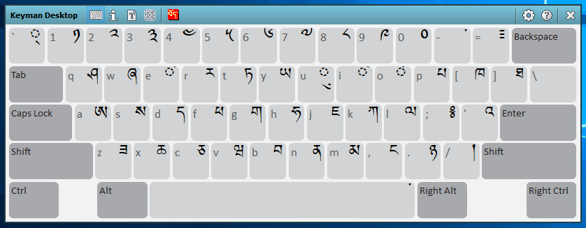

The On Screen Keyboard tool of the [Keyman Toolbox](../toolbox/)
shows the currently selected Keyman keyboard or Windows layout.

**Note:**
Some Keyman keyboards do not contain an On Screen Keyboard view. You can
find more help for those keyboards from the Help icon on the Keyman Toolbox toolbar.

## Opening the On Screen Keyboard

To open the On Screen Keyboard:

1.  Click on the Keyman icon , on the
    Windows Taskbar near the clock.

2.  From the Keyman menu, select On Screen Keyboard.

## Using the On Screen Keyboard

You can use the On Screen Keyboard in two ways:

-   As a reference help, to teach you how to type all the letters in
    your Keyman keyboard.
-   To enter text by point-and-click.

To use the On Screen Keyboard as a reference help:

1.  Open the On Screen Keyboard
2.  Type on your physical keyboard, using the On Screen Keyboard as a
    guide.

    **Note:**
    The On Screen Keyboard will match the Shift state of your hardware
    keyboard. This means you can press any combination of <kbd>Shift</kbd>,
    <kbd>Ctrl</kbd>, <kbd>Alt</kbd> and <kbd>AltGr</kbd> (or
    <kbd>RightAlt</kbd>) and the On Screen Keyboard will change
    to show you the modifier state of your hardware keyboard.

To enter text using the On Screen Keyboard:

1.  Position your text cursor where you want to type in your
    application.

2.  On the On Screen Keyboard, click <kbd>Shift</kbd>, <kbd>Ctrl</kbd> or
    <kbd>Alt</kbd> if you need them to type your desired character.

3.  On the On Screen Keyboard, click the key with the character you want
    to enter.

When a Keyman keyboard is on, the black font on the keycaps shows the
characters assigned to each key. The smaller grey font on the keycaps
shows the characters of the Windows layout currently associated with the
Keyman keyboard.

When no Keyman keyboard is on, the grey font on the keycaps shows the
characters of your active Windows layout.

**Note:**
Some Keyman keyboards do not have an On Screen Keyboard view. For
keyboards designed phonetically, this is because there is not a simple
1-1 correspondence between each key and the letter you want to type. The
keyboard help will usually provide more information on how to use these
keyboards.

## Related Topics

-   [The Keyman Toolbox](../toolbox/)
-   [Keyman Configuration - Options tab](../config/options)
