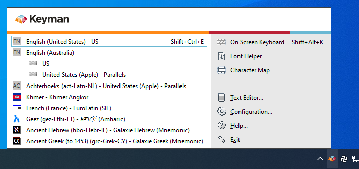
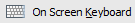

## Opening the Keyman Menu

When you start Keyman, the Keyman icon
() is displayed on the Windows
Taskbar near the clock. This area is called the System Tray or System
Notification Area.

To display the Keyman menu, click on the Keyman icon.

**Note**: If you cannot find the Keyman menu or Keyman icon, for more help see:

[Finding a Missing Keyman Menu](make-taskbar-icon-visible)

## Using the Keyman Menu

Click the Keyman icon () with either
mouse button to bring up the Keyman menu.

The left side of the Keyman menu lists the Keyman keyboards currently
installed and enabled on your computer. Click on a keyboard to turn it
on and start using it.

**Note**: You can add more Keyman keyboards to the Keyman menu through the Keyboard
Layouts tab of Keyman Configuration.

**Note**: To use a Keyman keyboard, the keyboard must be enabled in the Keyboard Layouts
tab of Keyman Configuration. For help enabling your keyboard, see
[Keyboard Task - Enable or Disable a Keyboard](enable-or-disable-keyboard).

The right side of the Keyman menu contains links to tools and features
in Keyman:

: Opens or closes the On Screen Keyboard tool

: Opens or closes the Font Helper tool

: Opens or closes the Character Map tool

: Opens the Keyman Text Editor

: Opens Keyman Configuration

: Opens Keyman Help

: Exits Keyman

## Finding a Missing Keyman Menu

If you cannot find the Keyman icon for the Keyman menu, it may be in the
hidden notifications area of the Windows Taskbar. Check for the Keyman
icon by clicking the arrow or triangle next to the Windows clock.

If the Keyman icon is in this collection, you can optionally
[move it permanently to the Windows Taskbar](make-taskbar-icon-visible),
to make it more easily accessible. However, Keyman will run
correctly even if the icon is left in this collection.

## Related Topics

-   [The Keyman Toolbox](toolbox/)
-   [Keyboard Task - Turn on a Keyboard](select-keyboard)
-   [How To - Make the Keyman icon visible](make-taskbar-icon-visible)