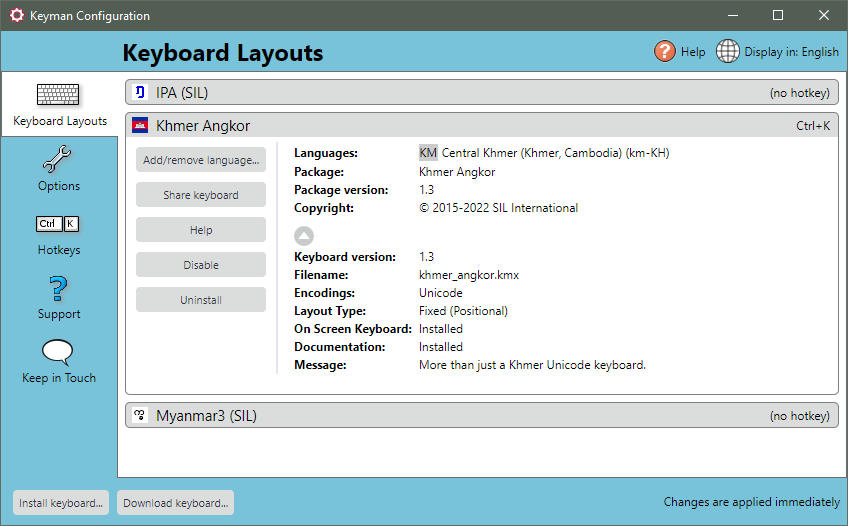

Uninstalling a Keyman keyboard removes it from Keyman. If you want to
use the Keyman keyboard again it must be reinstalled.

**Note:** You can disable a keyboard temporarily, instead of uninstalling it. For
more help, see: [Keyboard Task - Enable or Disable a Keyboard](enable-or-disable-keyboard).

To uninstall a Keyman keyboard:

1.  Open Keyman.

2.  Click on the Keyman icon , on the
    Windows Taskbar near the clock.

    

3.  Select Configuration.

4.  Select the Keyboard Layouts tab.

    

5.  Click on the keyboard name for the keyboard you want to uninstall to
    expand options associated with it.

6.  Click the Uninstall button.

7.  A message box is displayed asking you to confirm this is the package
    or keyboard layout that you wish to uninstall.

8.  Click OK.

The Keyman keyboard is now removed from Keyman.

## Related Topics

-   [Keyboard Task - Enable or Disable a Keyboard](enable-or-disable-keyboard)
-   [Keyboard Task - Turn on a Keyboard](select-keyboard)
-   [How To - Download and Install a Keyman Keyboard](../start/download-and-install-keyboard)
