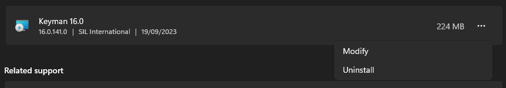

## Uninstall Keyman from Windows 10

1.  Exit Keyman.

2.  Open Windows Start Menu and type "Add or Remove Programs", and open that app.

3.  In the App & features search box, type "Keyman".

4.  Click Keyman in the list.

5.  Click Uninstall.

6.  Follow the prompts to complete the uninstall.

## Uninstall Keyman from Windows 11

1.  Exit Keyman.

2.  Open Windows Start Menu and type "Add or Remove Programs", and open that app.

3.  In the Apps > Installed apps search box, type "Keyman".

4.  Click the three horizontal dots to the right of Keyman in the list.

5.  Click Uninstall.

6.  Follow the prompts to complete the uninstall.
