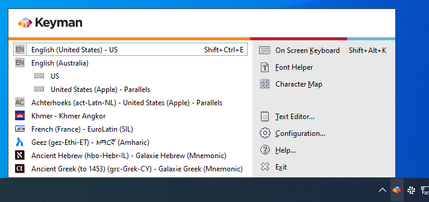
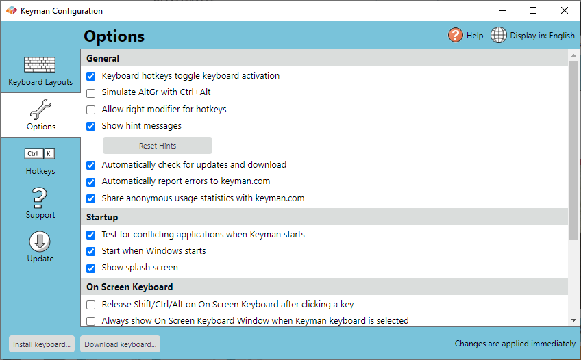
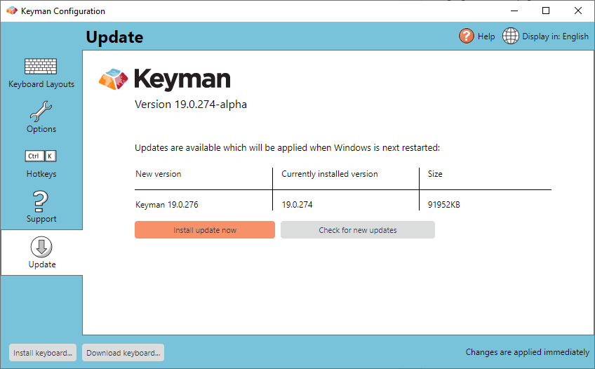

## Check for Updates Automatically

Keyman can check for updates automatically. Here\'s how:

1.  Open Keyman.

2.  Open Keyman Configuration, from the Keyman menu (on the Windows
    Taskbar near the clock).

    

3.  Select the Options tab.

    

4.  Tick \'Automatically check for updates and download\'

## Check for Updates Manually

You can check for updates at any time. Here\'s how:

1. Select Update tab and click \'Check for new updates\'.

    

2. Click \'Install update now\'.

    

## Updating Manually

You can manually update Keyman at any time by downloading and installing
Keyman for Windows again from the [Keyman Website](https://keyman.com/windows/download).

## Related Topics

-   [Proxy Configuration](../advanced/proxy_config)
