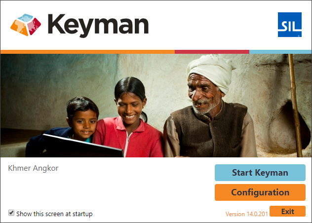

The Splash screen shows information about which keyboards are installed,
plus the version of Keyman.

You can stop the splash screen from showing by deselecting the option
'Show this screen at startup'.

Note: when Keyman starts with Windows, the splash screen is not shown.
