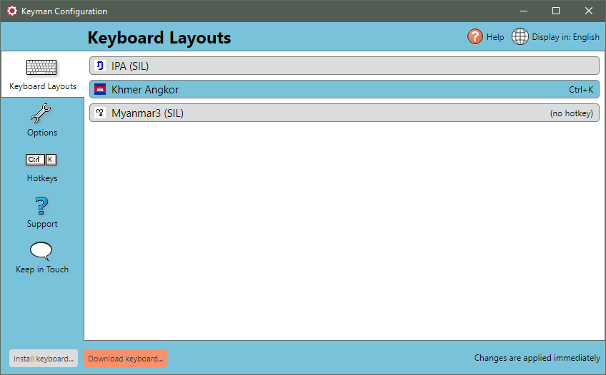
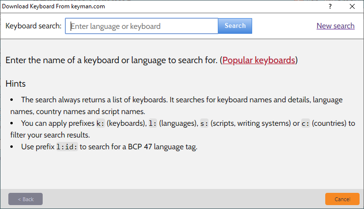
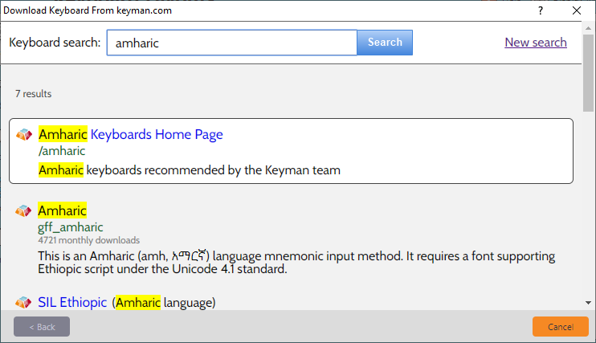
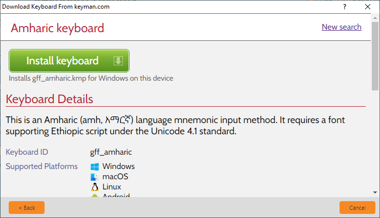
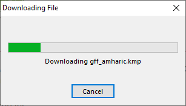
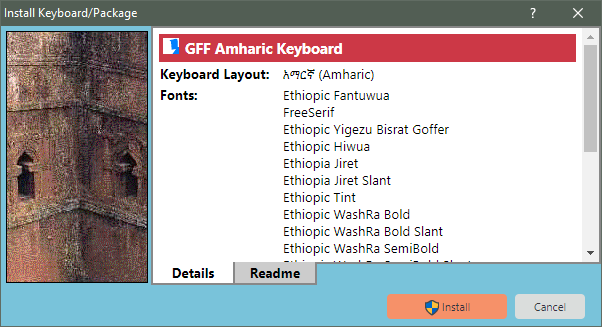
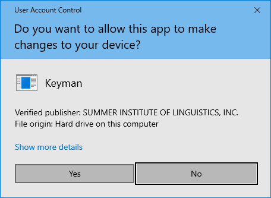

You must have a Keyman keyboard installed to type with Keyman in your
language. You can download and install a Keyman keyboard at the same
time you download and install Keyman. For more information, see:
[How To - Download and Install Keyman](download-and-install-keyman).

You can also add keyboards to Keyman after you have installed Keyman.
For more information, keep reading.

## Downloading & Installing a Keyman Keyboard within Keyman

Here's how to download and install a Keyman keyboard within Keyman:

1.  Start Keyman.

2.  Open Keyman Configuration, from the Keyman menu (on the Windows
    Taskbar near the clock).

    

3.  Click Download keyboard… at the bottom of the window.

    

4.  Type a language name, a country name, a keyboard name or even name of
    the author of the keyboard into the search box, or click the Popular
    keyboards link to see some of the most commonly installed keyboards.

    

5.  After a moment, Keyman will present a list of keyboards. Choose the
    keyboard you wish to install.

    

6.  A page with more details about the keyboard will be presented.
    Click Install keyboard in this page to continue downloading and
    installing the keyboard.

    

7.  The keyboard will be downloaded to your computer.

    

8.  Click Install at the Install Keyboard/Package dialog.

    

    **Tip:** The Install Keyboard/Package dialog includes some helpful
    information about the keyboard you are installing. In addition to
    the name, encoding standard, and version of the keyboard, the dialog
    may also show:
    -   Fonts to be installed with the keyboard.

    -   Author name and contact information.

    -   Specific help and readme information (under the readme tab).

    **Note:** Install installs the keyboard for anyone who can log on to your
    computer.

    **Note:** If a keyboard with the same name is already installed, Keyman will
    automatically replace it.

9.  You may be prompted by User Account Control to allow
    Keyman to make changes to your computer -- click 'Yes'.

    

    **Note:** If you have a separate administrator account -- that is, you are
    prompted to enter a username and password at this point -- you may need to
    [add a language association](configure-computer) for your keyboard on your
    user account after completing the keyboard installation.

10. The keyboard will now be installed; you can close Keyman Configuration.

## Installing a Keyman Keyboard from a Folder on Your Computer

There are two ways you can install a Keyman keyboard from a folder on
your computer. The easiest way is to find the keyboard on your computer
and double-click to install it. Keyman keyboards have a file name that
ends with .KMX or .KMP.

You can also install a keyboard from your computer within Keyman. Here's
how:

1.  Start Keyman

2.  Open Keyman Configuration, from the Keyman menu in the Windows
    taskbar.

    

3.  Select the Keyboard Layouts tab.

4.  Click Install keyboard….

5.  Find and select the keyboard on your computer.

6.  Click Open.

7.  Click Install at the Install Keyboard or Package dialog. You may be
    prompted by User Account Control to allow Keyman to make changes to
    your computer -- click 'Yes'.

    **Tip:** The Install Keyboard/Package dialog includes some helpful
    information about the keyboard you are installing. In addition to
    the name, encoding standard, and version of the keyboard, the dialog
    may also show:
    -   Fonts to be installed with the keyboard.

    -   Author name and contact information.

    -   Specific help and readme information (under the readme tab).

    -   Other details.

    **Note:** Install installs the keyboard for anyone who can log on to your computer.

    **Note:** If a keyboard with the same name is already installed, Keyman will
    automatically replace it.

8.  Click OK to save your settings and exit Keyman Configuration.

## Related Topics

-   [How To - Download and Install Keyman](download-and-install-keyman)
-   [Keyboard Task - Turn on a Keyboard](../basic/select-keyboard)
-   [Keyboard Task - Enable or Disable a Keyboard](../basic/enable-or-disable-keyboard)
-   [Keyboard Task - Uninstall a Keyboard](../basic/uninstall-keyboard)
-   [Keyman Configuration - Keyboard Layouts Tab](../basic/config/keyboards)
-   [Keyman Configuration](../basic/config/)
