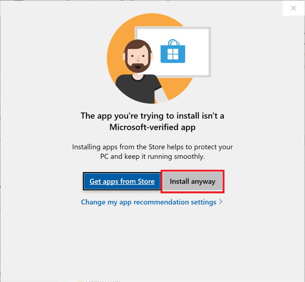
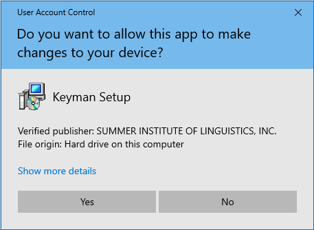
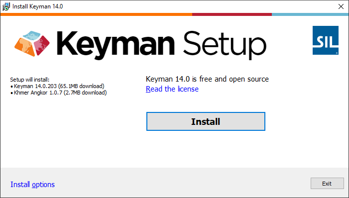

## Downloading Keyman

You can download Keyman with a keyboard for your language from the
[Keyman Website](https://keyman.com/windows/download).

## Installing Keyman

After you download Keyman, to install the program:

1.  Find the Keyman executable file on your computer. The name of the
    file begins with 'keyman-' and ends with '.exe'. It should
    be visible in the Downloaded Files interface of your web browser.

2.  Double-click the file to begin installation.

3. You may be warned to use a "Microsoft-verfied" App from the Microsoft Store. This is because Keyman is not available in the Microsoft Store. If "**Install Anyway**" is an option, select that. Otherwise follow the instructions found here [How To - Allow Windows to Install Apps From Anywhere](../troubleshooting/install-app-from-anywhere)

4.  You will be asked to allow the installer to access your system.
    Click Yes to continue.

    

5.  The installer may need to download additional components from keyman.com
    in order to complete the installation. If prompted by your firewall
    software, ensure you Allow the installer to access the web.

6.  Click Install Keyman to finish installing. Keyman may download additional
    files during the installation process.

    

    **Note:** If you downloaded Keyman together with a keyboard, the keyboard
    that will be installed will be shown on the left, as in the image above.

    **Note:** You can select advanced installation options from the Install
    Options link on the bottom left.

7.  At the end of the installation, click Start Keyman to begin using
    Keyman or click Configuration to change Keyman settings first.

    

When you finish your installation of Keyman, you can delete or move the
installation's executable file. It doesn't need to remain on your
computer for Keyman to work.

## Related Topics

-   [How To - Download and Install a Keyman Keyboard](download-and-install-keyboard)
-   [Software Task - Uninstall Keyman](../basic/uninstall)
