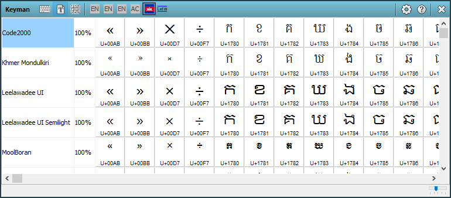

Many Keyman keyboards type out letters that need special fonts. Without
the right font, these letters may turn into square boxes or become
unreadable. You can find the best fonts for your Keyman keyboard by
using the Font Helper tool in the Keyman Toolbox. Here's how:

1.  Open the Font Helper tool, from the Keyman menu in the Windows
    taskbar.

2.  Turn on a Keyman keyboard. You can turn on a Keyman keyboard from
    the Keyman menu, the Keyman Toolbox, or with a keyboard hotkey.

You will now see a list of all the fonts on your computer which have
some support for your active Keyman keyboard. You will also see a
percentage beside each font. The percentage represents the number of
letters in your keyboard which the font supports. A font does not have
to be 100% to work well for your keyboard, but higher percentages are
better. You will also see a chart in the Font Helper, showing exactly
which letters and symbols from your keyboard are supported by each font.

**Note:** The Font Helper tool is designed to tell you which fonts support the
letters and characters in your language. It is not intended to show you
which fonts will look the nicest for your language or text. You can use
the Font Helper tool to see how different fonts display the individuals
letters and characters in your language. You should test the fonts in
your text to see which fonts look the best for your entire text.

## Related Topics

-   [How To - Fix Font Issues](../troubleshooting/font)
-   [How To - Download and Install a Keyman Keyboard](download-and-install-keyboard)
-   [Keyman Toolbox - Font Helper](../basic/toolbox/font-helper)
-   [Keyman Configuration - Hotkeys Tab](../basic/config/hotkeys)
-   [Keyboard Task - Turn on a Keyboard](../basic/select-keyboard)
