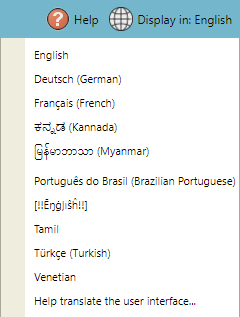

## Setting a Language for Keyman Menus

If you would like the menus in Keyman to be in a language other than
English:

1.  Open Keyman Configuration, from the Keyman menu in the Windows
    taskbar.

2.  Click English in the 'Display in:' menu on the top right corner.

    

3.  Select your language from the list. If your language is not in the
    list, click Find other display languages online….

    **Note:** If your language is not available online, you can write your own
    translation for your language using our locale editor. For more
    information, see [Translating the Keyman for Windows User Interface](../advanced/locale_edit).

4.  Restart Keyman for the language changes to take effect for the
    entire program.

## Related Topics

-   [Keyman Configuration](../basic/config/)
-   [Translating the Keyman for Windows User Interface](../advanced/locale_edit)
