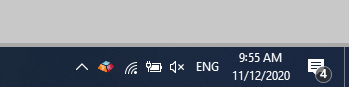

Follow these steps for a basic introduction to Keyman:

> [!Note]
> Keyman must be installed first. For help on installing Keyman, please see: [How To - Download and Install Keyman](download-and-install-keyman).

## Step 1

Check the Windows Taskbar near the clock to see if Keyman is running. If
it is running you will see the Keyman icon:

## Step 2

If the Keyman icon is in the Windows Taskbar near the clock, continue on
to [Step 5](#step-5-).

If the Keyman icon is not on the Windows Taskbar near the clock, click
the arrow or triangle near the clock:

-   You will see a collection of icons. If the Keyman icon
    () is not in this collection,
    Keyman is not running. Read steps 3 and 4 to learn how to start
    Keyman.

-   If the Keyman icon is in this collection, you can optionally
    [move it permanently to the Windows Taskbar](../basic/make-taskbar-icon-visible),
    to make it more easily accessible. However, Keyman will run
    correctly even if the icon is left in this collection.

## Step 3

To Start Keyman, click on the Windows Search box, type "Keyman",
and select Keyman from the list of Apps (it will probably be the
best match).

## Step 4

Keyman may show a startup screen; simply click Start Keyman to
start the app. Keyman will now be running and the Keyman icon will be on the Windows
Taskbar near the clock.

## Step 5

Open a typing application, like Microsoft Word.

## Step 6

Select a Keyman keyboard from the Keyman menu. You will notice the
Keyman menu icon change to the icon of your Keyman keyboard. This means
your Keyman keyboard is on.

**Tip:** If there are no Keyman keyboards in the Keyman menu, you can learn how to install one here:

-   [How To - Download and Install a Keyman Keyboard](download-and-install-keyboard)

## Step 7

To learn how to type with your new Keyman keyboard, open the On Screen
Keyboard tool of the Keyman Toolbox. You can open the On Screen Keyboard
tool from the On Screen Keyboard link in the Keyman menu.

**Tip:** Some Keyman keyboards do not include an On Screen Keyboard. You can
usually find help for these keyboards in the keyboard help, by clicking the
help icon in the Keyman Toolbox.

## Step 8

You can now start typing in your language in almost any application. Use
your hardware keyboard or click the On Screen Keyboard keys to type.

## Step 9

To return to using your normal keyboard, open the Keyman menu and select your default language from the list presented to you.

## Related Topics

-   [How To - Download and Install Keyman](download-and-install-keyman)
-   [How To - Download and Install a Keyman Keyboard](download-and-install-keyboard)
