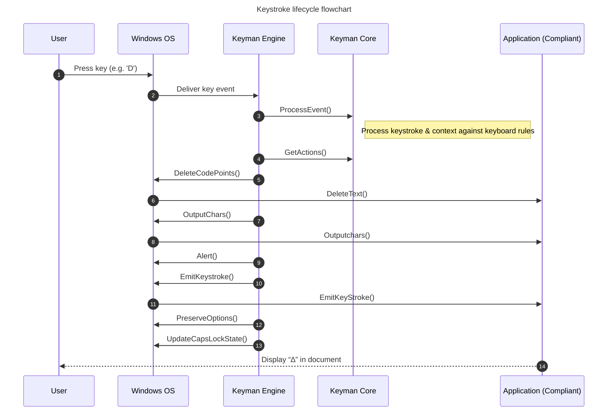

# Introduction
The three main parts that make up the lifecycle of a keystroke on the Windows
platform.

1. Capture Key Stroke
2. Keystroke Processing against Keyboard rules
3. Apply Action Result

1 and 3 are processed in the Keyman Engine integrated to the Windows operating
system. Where as the Keyman Core is the same core logic library used across all
desktop platforms.

## Capture Keystroke
There are two main mechanisms for capture the keystrokes one is the hook
GetMessageProc the other is TIPTextService. There is another Hook
LowLevelKeyboardProc used for the serial event server but it is out of scope for
this document.

### kmnGetMessageProc
Not all key presses make it to the TSF TIP, especially modifiers. Therefore this
hook ensures the Keyman engine receives all keystrokes. The relevant messages
are WM_KEYDOWN, WM_SYSKEYDOWN, WM_KEYUP, WM_SYSKEYUP.

### CKMTipTextService

This is TextServicesFramework input method.

Once the modifier state and the keystroke has been determined. The keystroke and
modifier state is passed to Keyman core.

## Keyman Core - Keystroke Processing against Keyboard rules

The Keyman Core will process the keystroke with the current context against the
keyboard rules and produce the output actions.

The Keyman Core contains the keyboard processor class in which instances
implement the KMX or LDML protocol specification The core allows for Keyboard
layouts. The Keyboard layouts contain rules for interpreting keystrokes,
determining the effects that should arise when evaluating the incoming keystroke
with the current context state.

When Keyman Core process keystroke event is successful there will be a actions
object with the required actions the Keyman Engine needs to apply to the current
Windows app. The Keyman Engine will use a Get Actions call to retrieve the
actions.

## Apply Action Result
The actions that could be required are the following. There maybe only one
action or multiple actions that need to be applied for example if the only
action could be to output a character.

`code_points_to_delete;` The number of code points to delete next to the current
cursor position.

`const km_core_usv* output;` The characters to output next to the character
position after processing code_points_to_delete. The Keyman Engine function
`KeymanProcessOutput` uses has key functions  `DeleteLeftOfSelection` and
`InsertTextAtSelection` which make use of the Text Services Framework API using
functions such as `SetText`

`km_core_option_item * persist_options;` These are options that effect how a
rule is processed that needs to be saved in the operating system so that when
the keyboard layout is loaded in the future those options can be set from the
Operating System. For Windows the Keyman Engine makes use of the Windows
Registry. The key functions are `SaveKeyboardOptionCoretoRegistry` and
`LoadKeyboardOptionsRegistrytoCore`

`km_core_bool do_alert;` This Keyman Engine will cause the audible alert so the
user knows incorrect or unexpected input has been input.

`km_core_bool emit_keystroke;` Tells the Keyman Engine to emit the keystroke
that it is currently being processed to the application.

`km_core_caps_state new_caps_lock_state;` The new capslock state. The Keyman
Engine may need to synthesize a capslock press so the Windows OS is in the
correct state.

`const km_core_usv* deleted_context;`

A copy of the the deleted_context due to the result of processing this
keystroke.

The Keyman Engine will then use the Windows API to apply the actions required.

The difference for complaint and not complaint apps in this explanation is that
with compliant apps the context can be sent and verified by the Keyman core with
each keystroke. With non compliant apps the Keyman Core will keep track
internally of the context. For more detailed explanation see: [Compliant and
Non-compliant Applications in Windows, Mac and
Linux](https://help.keyman.com/knowledge-base/?id=118) Which includes a more
complete sequence diagram.

The sequence diagram show the keystroke life cycle. Note that all actions are
shown from Engine to OS but on any given keystroke it will not be all of those
actions.

## References

- [Keystroke Lifecycle Web](../../../web/docs/internal/keystroke-lifecycle.md)
- [Keyman Core API documentation](../../../core/docs/api/index.md)
- [Compliant and Non-compliant Applications in Windows, Mac and Linux](https://help.keyman.com/knowledge-base/?id=118)

**Serial event server and Keystroke processing note.** There is seralized event
queue described in this blog post
https://blog.keyman.com/2018/10/the-keyman-keyboard-input-pipeline/ It can be
considered distinct part the rest of the key press life cycle. Infact the it can
be turned on and off via feature flag. This explanation of the lifecycle talks
as if the keystrokes come in order.

## Glossary

Modifer Key: Caps, Shift, Alt, Ctrl

