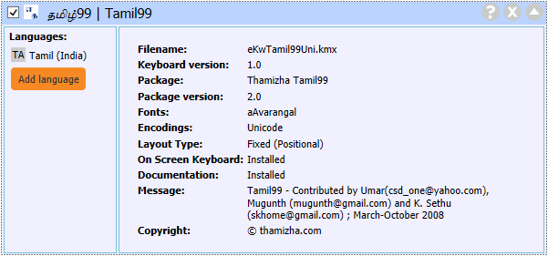
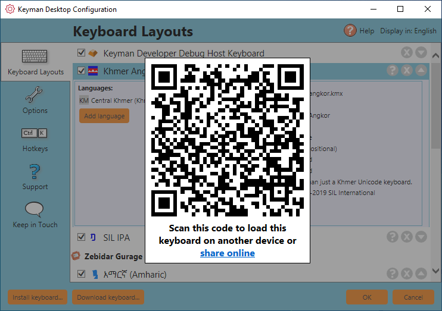

The Keyboard Layouts tab of Keyman Configuration lists all the Keyman
keyboards which are currently installed on your computer. You can use
the Keyboard Layouts tab to install and uninstall keyboards, enable and
disable keyboards, set keyboard hotkeys, show keyboard help and view
keyboard details.

## Opening the Keyboard Layouts Tab

To open the Keyboard Layouts tab of Keyman Configuration:

1.  Click on the Keyman icon , on the
    Windows Taskbar near the clock.

2.  From the Keyman menu, select Configuration....

3.  Select the Keyboard Layouts tab.

    **Tip:**
    Keyman Configuration opens in the same tab you last closed it in.

## Installing a Keyboard

To install a keyboard layout in Keyman, see: [Installing a Keyman Keyboard within Keyman](../../start/download-and-install-keyboard)

## Uninstalling a Keyboard

To uninstall a Keyman keyboard from the Keyboard Layouts tab of Keyman
Configuration, see: [Keyboard Task - Uninstall a Keyboard](../uninstall-keyboard)

## Enabling and Disabling a Keyboard

To enable or disable a Keyman keyboard from the Keyboard Layouts tab of
Keyman Configuration, see: [Keyboard Task - Enable or Disable a Keyboard](../enable-or-disable-keyboard)

## Setting a Hotkey

To set a hotkey for a Keyman keyboard, use the [Hotkeys tab](hotkeys).

## Showing Introductory Help

To show introductory help for a Keyman keyboard from the Keyboard
Layouts tab of Keyman Configuration:

1.  Find a keyboard in the keyboard list.

2.  Click on the question mark icon
    () beside the keyboard
    name. The keyboard help documentation will be shown.

## Viewing Keyboard Details

To view details for a Keyman keyboard from the Keyboard Layouts tab of
Keyman Configuration:

1.  Find a keyboard in the keyboard list.

2.  Click on the down arrow
    () beside the keyboard
    name. The keyboard information window will expand.

    

3.  In the information window you can view keyboard details, including:

    -   Keyboard filename.
    -   Keyboard package name.
    -   Keyboard version number.
    -   Keyboard encodings.
    -   Keyboard layout type.
    -   On Screen Keyboard status.
    -   Documentation status.
    -   Copyright details.
    -   Installation details.

## Sharing a keyboard with other users and devices

If you installed a keyboard layout using the Download keyboard button,
then you can share the keyboard with other devices and users using a QR
Code.

1.  Expand the keyboard details for the keyboard you wish to share, and
    click Share keyboard.

2.  A popup will appear with a QR Code. This QR Code can be scanned with
    a mobile phone camera to automatically open a web page with a
    download link to install the keyboard.

    

## Associating a keyboard with a Windows language

All Keyman keyboards are associated with a Windows language by default.
To change the association, or add a new association, see the following:

-   [How To - Set up Your Computer for a Keyman Keyboard](../../start/configure-computer)

## Related Topics

-   [Keyman Configuration](../config/)
