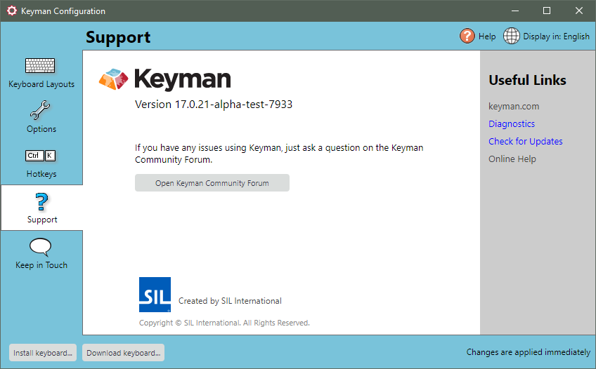

The Support tab of Keyman Configuration displays Keyman version
information and support tools. You can use the Support tab to send a
support request, check Windows language settings, check for updates, and
view Keyman version information.

## Opening the Support Tab

To open the Support tab of Keyman Configuration:

1.  Click on the Keyman icon , on the
    Windows Taskbar near the clock.

2.  From the Keyman menu, select Configuration....

3.  Select the Support tab.

    **Tip:**
    Keyman Configuration opens in the same tab you last closed it in.

## Collecting Diagnostic Information

You can collect diagnostic information about Keyman by clicking the
\'Diagnostics\' link under the \'Useful Links\' section. The support
diagnostic will collect critical diagnostic information from your
computer and generate a report.

## Checking for Updates

To check for Keyman updates, from the Support tab of Keyman
Configuration click the \'Check for Updates\' link. You can also
download and install Keyman again from the Keyman website.

## About Version Information

You can view version details from the Support tab of Keyman
Configuration. In the Support tab you will see a version
number beneath the Keyman logo. This version number will show
whether you are using a stable or pre-release version of Keyman
and should be reported in its entirety if you are ever requesting
help from the Keyman Community.

## Accessing the Keyman Community

[Keyman Community](https://community.software.sil.org/c/keyman)

-   Click the Open Keyman Community button. The forums will open in your
    internet browser. You will need to have internet access for this to
    open successfully.

## Related Topics

-   [Keyman Configuration](../config/)
-   [How To - Download and Install Keyman](../../start/download-and-install-keyman)
