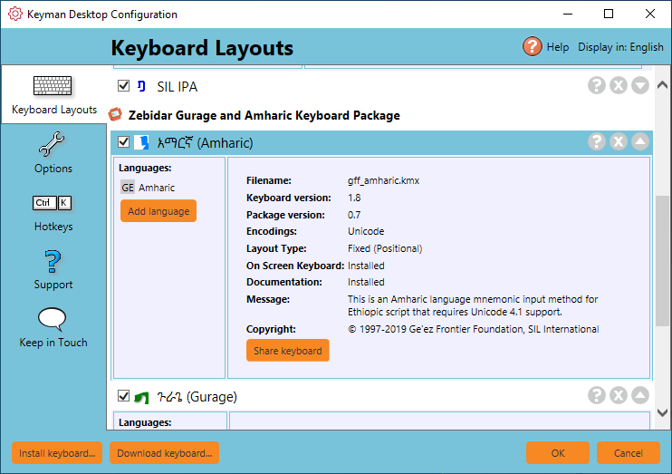

Keyman keyboards can be enabled and disabled. When disabled, they are
removed from the list of keyboards you can select from, but they are
not uninstalled.

## Disabling a Keyman keyboard

Disabling a Keyman keyboard removes it from the Keyman menu and Keyman
Toolbox but does not uninstall the keyboard. This is useful if:

-   You are using a single keyboard layout from a package with multiple
    keyboards and you want to remove the extra keyboards from the Keyman
    Toolbox and menu.

-   You have a keyboard layout installed which you aren\'t currently
    using but don\'t want to uninstall.

To disable a Keyman keyboard:

1.  Open Keyman.

2.  Click on the Keyman icon , on the
    Windows Taskbar near the clock.

    

3.  Select Configuration.

    

4.  Select the Keyboard Layouts tab.

5.  Untick the checkbox beside the Keyman keyboard.

6.  Click OK.

When a keyboard layout is disabled, its name appears in grey and its
checkbox is unticked.

## Enabling a Keyman keyboard

To enable a Keyman keyboard:

1.  Open Keyman.

2.  Click on the Keyman icon , on the
    Windows Taskbar near the clock.

    

3.  Select Configuration.

    

4.  Select the Keyboard Layouts tab.

5.  Tick the checkbox beside the Keyman keyboard.

6.  Click OK.

## Related Topics

-   [Keyboard Task - Uninstall a Keyboard](uninstall-keyboard)
-   [Keyboard Task - Turn on a Keyboard](select-keyboard)
-   [Keyman Configuration - Keyboard Layouts Tab](config/keyboards)
