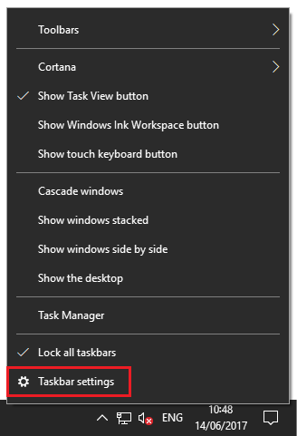
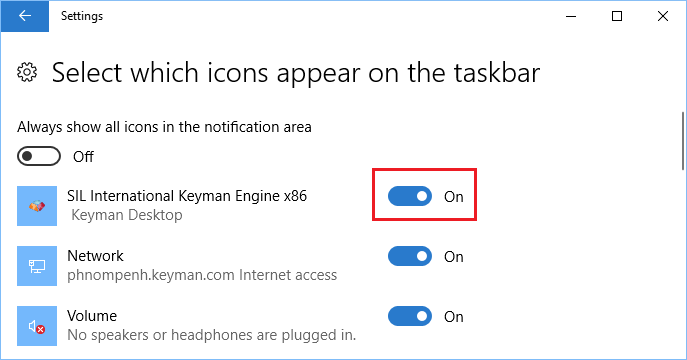
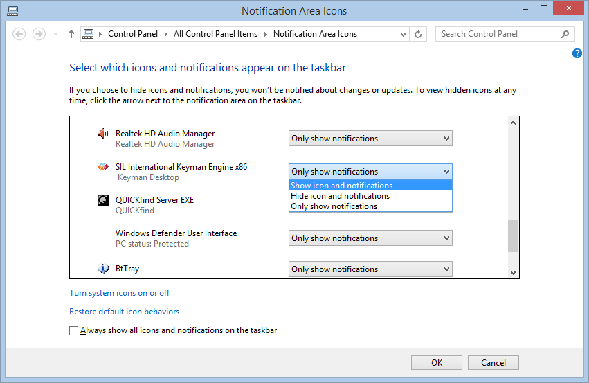

If the Keyman icon is not on the Windows Taskbar near the clock, click
the arrow or triangle near the clock:

-   You will see a collection of icons. If the Keyman icon
    () is not in this collection,
    Keyman is not running.

-   If the Keyman icon is in this collection, you can optionally
    move it permanently to the Windows Taskbar, to make it more
    easily accessible. However, Keyman will run correctly even if
    the icon is left in this collection.

## Move the icon with the mouse

You can move the Keyman icon simply by dragging it down to the Taskbar
notification area with your mouse.

## Move the icon using Windows Settings

Here's how to make the change with Windows Settings:

-   On Windows 10

    1.  Right-click on the Windows Taskbar.
        
    2.  Select 'Taskbar settings'.
    3.  Under 'Notification area', click on 'Select which icons
        appear on the taskbar'
        
    4.  From the toggle button beside 'Keyman
        Engine x86', click to turn it on.
        
    5.  The Keyman icon will now always appear in the Windows
        Taskbar near the clock, if Keyman is on.
    6.  Continue on to [Step 5](#tutorial_step5) of this guide.

-   On Windows 8:

    1.  Right-click on the Windows Taskbar.
        
    2.  Select 'Properties'.
    3.  Next to 'Notification area', click Customize….
        
    4.  From the dropdown menu beside 'Keyman
        Engine x86', select 'Show icon and notifications'.
        
    5.  Click OK to apply changes. The Keyman icon will now always
        appear in the Windows Taskbar near the clock, if Keyman is
        on.
    6.  Continue on to [Step 5](#tutorial_step5) of this guide.

-   On Windows 7:

    1.  Open the Windows Start menu.
    2.  In the search field, type and enter: Notification Area Icons
    3.  From the dropdown menu beside Keyman
        Engine x86, select 'Show icon and notifications'.
        
    4.  Click OK to apply changes. The Keyman icon will now always
        appear in the Windows Taskbar near the clock, if Keyman is
        on.
    5.  Continue on to [Step 5](#tutorial_step5) of this guide.