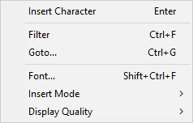
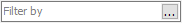
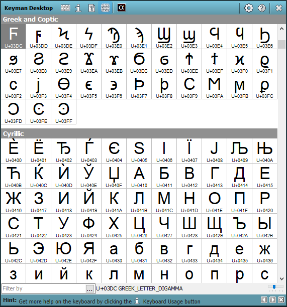
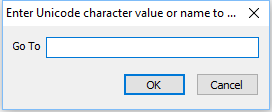
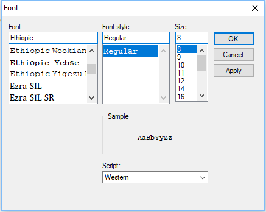
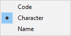
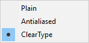

The Character Map tool in the [Keyman Toolbox](../toolbox/) can be
used to find and insert any standard Unicode character into your text.

## Opening the Character Map

To open the Keyman Character Map:

1.  Click on the Keyman icon , on the
    Windows Taskbar near the clock.

2.  From the Keyman menu, select Character Map.

## Using the Character Map

To insert a character from the Character Map into a document:

1.  Position the text cursor in your document where you want to insert
    the character.

2.  Locate the character in the Character Map.

3.  Insert the character by:

    -   Selecting the character and pressing the Enter key.

    -   Double-clicking on the character.

    -   Right-clicking on the character and selecting Insert Character.

**Note:**
If the Insert Mode is set to Code or Name, pressing Enter or
double-clicking on a character will insert the Unicode code or Unicode
name of the character, not the character itself!

**Note:**
You can also hold Ctrl and then a single click on a character will
insert it into the document. This allows for smoother insertion of
multiple characters from the Character Map.

## Character Map Options

Right click on the Character Map to display a menu with the following
options:

|Option    |Description |
|----------|------------|
|Insert Character | Inserts the selected character at the cursor position in your document.|
|Filter... | Sends the curser to the \'Filter by\' Character Map search field. See [Filtering](#filtering) below.|
|Goto...| Displays the Goto dialog box. See [Goto](#goto) below.|
|Font...| Allows you to choose a different font for use in the Character Map. This will not affect the font being used in your document! See [Fonts and Characters](#fonts) below.|
|Insert Mode | Allows you to select your desired character insert mode. See [Insert Modes](#insertmodes) below.|
|Display Quality | Allows you to set the desired display quality for the characters in the Character Map. See [Display Quality](#displayquality) below. |

## Character Map Options - Filter...

You can search the Character Map by using the Filter by search field at
the bottom of the Character Map window.

When no search filter is applied, the Character Map shows all characters
from the Unicode standard. If a filter has been applied, the name of the
filter will appear in the upper left corner of the Character Map window.

The following parameters define how the search filter in the Character
Map works:

-   When searching by Unicode name, the filter field searches within of
    the Unicode name.

-   When searching by Unicode code point or range, the filter field
    allows 2, 3, and 4 digit partial code points. For example, all of
    the following will give the Latin Capital Letter E (U+0045):

    -   45
    -   045
    -   0045
    -   U+45
    -   U+045
    -   U+0045

-   Filter entries can use the letters A-Z, the numerals 0-9 and the
    characters underscore (\_), hyphen (-) and plus (+).

-   Filter entries are NOT case sensitive.

-   Spaces between words in a filter entry can be represented by either
    underscore (\_) or space ( ). Spaces at the end of a filter entry
    must be represented by underscore; otherwise they will be discarded
    during the search.

-   Filters can be entered by Unicode character names or Unicode
    character ranges.

-   The filtering format for a character range is given below, where U+
    is optional, XXXX is the starting Unicode value and YYYY is the
    finishing Unicode value.

        [U+]XXXX-[U+]YYYY

-   The filtering options for character names are:

    -   `>` placed at the start of an entry will only show characters
        in the currently selected Character Map font. This is helpful
        when trying to determine which characters a given font supports.

    -   `<` placed at the start of an entry will search Unicode block
        names instead of character names. This is helpful when searching
        for characters within related blocks (e.g. all Latin blocks).

    -   Words are searched in order, so for example `latin capital letter b`
        will not find different results than `latin letter capital b`.

    -   Using `?` anywhere in an entry serves as a wildcard for that
        single place in the entry. For example, searching for `s???e`
        will return both the SPACE and the SMILE characters, among
        others.

    -   `[ - ]` is used to match any character in a set. For
        instance, `[ac-z]` matches all letters except "b". A set can
        be made up of ranges and individual characters, but cannot be
        made up of `?` or `*`.

    -   `$` placed at the end of an entry will match from the end of
        a Unicode character name. This option works best when used with
        `*` or `?`.

    -   As noted above, when no filtering options are in use, the filter
        field searches for characters within their Unicode names.

The following chart provides examples of filtering.

| Filter Entry          | Filter Result                                 |
|-----------------------|-----------------------------------------------|
| `latin capital letter a`      | Searches for all Unicode characters whose names contain the words starting with "latin", "capital", "letter", and "a". Thus, finds all variations of the Latin capital letter A, plus the Latin capital letter Alpha and the Latin capital letter African d.
| `latin letter a` | Searches for all Unicode characters whose names contain words starting with "latin", "letter", and "a". Thus, finds all variations of the Latin letter A capital and lower case, along with a small selection of other characters whose names fit the search.
| `_[aeu]_ acute` | Matches all letter "a", "e", or "u" with an acute mark. The `_` matches a space.
| `latin letter [aeiou]` | Searches for all Unicode characters whose names contains words starting with "latin", "letter", and "a", "e", "i", "o", or "u". Finds all variations of the Latin vowels A,E,I,O,U, both upper and lower case, along with a small selection of other characters whose names fit the search.
| `<latin` | Searches for all Unicode blocks which contain the word "Latin", e.g. Basic Latin, Latin-1 Supplement, Latin Extended-A, Latin Extended-B, Latin Extended Additional, Latin Extended-C, Latin Extended-D).
| `>lao` | Searches the current Character Map font for all available characters whose names begin with the sequence "Lao".
| `YI_` | Searches for all characters whose Unicode names begin with the sequence "YI" followed by a space. Finds all YI syllables and YI radicals. Note: You must use underscore (`_`) and not space (` `) at the end of a filter entry. Spaces at the end of a filter entry are discarded. If you had used `YI ` (with space) instead of `YI_`, the search would also return the character YIN_YANG.
| `latin letter _a$` | Searches for all Unicode characters whose names contain word starting with "latin" and "letter", and end with the word "a".
| `1000-109F` | Searches for all Unicode characters in the range from U+1000 to U+109F (inclusive). Finds all characters - in this case, the Myanmar block.

To help you edit filters, the Filter dialog is available from the
Character Map by clicking the 
button.

## Character Map Options - Goto...

The Goto tool can be used to move directly to a specific Unicode
character or value.

1.  Right click on a character and select Goto. The Enter Unicode
    character value or namedialog box will be displayed:

    

2.  Enter a Unicode character value (e.g. `6B` or `U+006B`) OR enter
    the start of the character name (e.g. `Lao letter`, which will go
    to the first matching character, "LAO_LETTER_KO")

3.  Click OK. The Character Map will move to the chosen character, if
    available.

## Character Map Options - Font...

You can choose the font for use in the Character Map tool by right
clicking on the Character Map window and selecting Font.

From the Font dialog, you can select to display the Character Map using
any of the fonts available on your system. If a character is not
available in the selected font, the Character Map will use font linking
to attempt to find a character from other fonts installed on your system.
As a last resort, the Character Map will show square boxes or question
marks if no suitable font can be found for a character.

## Character Map Options - Insert Mode

Characters can be inserted from the Character Map using one of three
insert modes - Code, Character and Name:

-   Code - Inserts the character's Unicode code.
-   Character - Inserts the character itself.
-   Name - Inserts the character's Unicode name.

To change the character insert mode:

1.  Right-click on the Character Map.
2.  Highlight the Insert Mode submenu.
    
3.  Choose the desired insert mode from the submenu.

## Character Map Options - Display Quality

There are three options for the display quality of characters in the
Character Map.

-   Plain - Uses no font smoothing.
-   Antialiased - Uses the Windows standard font smoothing.
-   ClearType - Uses the Windows ClearType font smoothing.

## Related Topics

-   [The Keyman Toolbox](../toolbox/)
