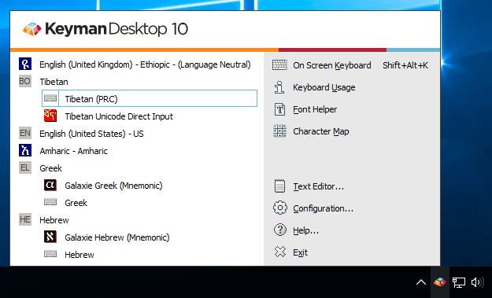

## Opening the Keyman Menu

When you start Keyman, the Keyman icon
() is displayed on the Windows
Taskbar near the clock. This area is called the System Tray or System
Notification Area.

To display the Keyman menu, click on the Keyman icon.

**Note**: If you cannot find the Keyman menu or Keyman icon, for more help see:

[Finding a Missing Keyman Menu](***)

## Using the Keyman Menu

Click the Keyman icon () with either
mouse button to bring up the Keyman menu.

The left side of the Keyman menu lists the Keyman keyboards currently
installed and enabled on your computer. Click on a keyboard to turn it
on and start using it.

**Note**: You can add more Keyman keyboards to the Keyman menu through the Keyboard Layouts tab of Keyman Configuration.

**Note**: To use a Keyman keyboard, the keyboard must be enabled in the Keyboard Layouts tab of Keyman Configuration. For help enabling your keyboard, see:

TODO: missing links

The right side of the Keyman menu contains links to tools and features
in Keyman:

TODO: missing icons and descriptions

-   – Opens or closes the
    On Screen Keyboard tool
    .
-   – Opens or closes the
    Keyboard Usage tool
    .
-   – Opens or closes the
    Font Helper tool
    .
-   – Opens or closes the
    Character Map tool
    .
-   – Opens the
    Keyman Text Editor
    .
-   – Opens
    Keyman Configuration
    .
-   – Opens
    Keyman Help
    .
-   – Exits Keyman.

## Finding a Missing Keyman Menu

If you cannot find the Keyman icon for the Keyman menu, it may be in the
hidden notifications area of the Windows Taskbar. Check for the Keyman
icon by clicking the arrow or triangle next to the Windows clock.

If the Keyman icon is in the hidden notifications area, you should move
the Keyman icon permanently to the Windows Taskbar. Here's how to move
the icon:

-   On Windows 7:

    1.  Open the Windows Start menu.

    2.  In the search field, type and enter: Notification Area Icons

    3.  From the dropdown menu beside SIL International Keyman Engine
        x86, select 'Show icon and notifications'.

        

    4.  Click OK to apply changes. The Keyman icon will now always
        appear in the Windows Taskbar near the clock, if Keyman is on.

-   On Windows 8 and above:

    1.  Right-click on the Windows Taskbar.

        

    2.  Select 'Properties'.

    3.  Next to 'Notification area', click Customize….

        

    4.  From the dropdown menu beside Keyman Engine
        x86, select 'Show icon and notifications'.

        

    5.  Click OK to apply changes. The Keyman icon will now always
        appear in the Windows Taskbar near the clock, if Keyman is on.

    6.  Continue on to [Step 5](#tutorial_step5) of this guide.

If the Keyman icon is not in the hidden notifications area and not on
the Windows Taskbar near the clock, make sure Keyman has been started.
If you still cannot locate the Keyman icon and menu, visit the [SIL
Keyman Community](https://community.software.sil.org/c/keyman) for
further assistance.

## Related Topics

-   [The Keyman Toolbox](toolbox)
-   [Keyboard Task - Turn on a Keyboard](enable_keyboard)
