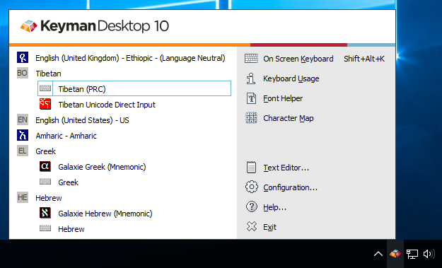
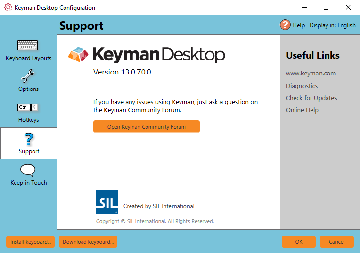

## Check for Updates Automatically

Keyman can check for updates automatically once a week. Here\'s how:

1.  Open Keyman.

2.  Open Keyman Configuration, from the Keyman menu (on the Windows
    Taskbar near the clock).

    

3.  Select the Options tab.

    

4.  Tick \'Automatically check keyman.com weekly for updates.\'

5.  Click OK to apply changes.

## Check for Updates Manually

You can check for updates at any time by clicking \'Check for
Updates...\' from the Support tab of Keyman Configuration.

## Updating Manually

You can manually update Keyman at any time by downloading and installing
Keyman for Windows again from the [Keyman Website](https://keyman.com/windows/download).

## Related Topics

-   [Proxy Configuration](../advanced/proxy_config)
