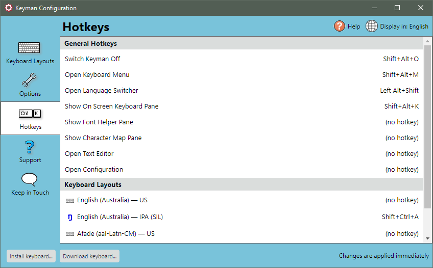

A hotkey is a keyboard shortcut. In Keyman these are used to turn on and
off Keyman functions, Keyman keyboards and Windows languages.

To set the hotkey for a Keyman function, Keyman keyboard or Windows
language:

1.  Open Keyman Configuration, from the Keyman menu in the Windows
    taskbar.

2.  Select the Hotkeys tab.

    

3.  Click the hotkey link beside the function, keyboard or language. The
    Change Hotkey dialog box will be displayed.

    

4.  Select a default hotkey or click Custom and type the hotkey you wish
    to use.

    **Note:** If you press a single letter or Shift plus a single letter, the
    hotkey will default to <kbd>Ctrl</kbd> + <kbd>Alt</kbd> plus the letter you pressed, in
    order to avoid conflicts with standard keyboard input.

    **Note:** To clear a hotkey that has been set previously, click Clear Hotkey
    or press Backspace.

    **Note:** Be aware that you can set the hotkey to replace common Windows hotkeys (
    <kbd>Ctrl</kbd> + <kbd>C</kbd>, <kbd>Ctrl</kbd> + <kbd>V</kbd>, etc). This is not
    recommended.

5.  Click OK to save your selection.

The new hotkey will now be available.

## Related Topics

-   [Keyman Configuration - Hotkeys Tab](../basic/config/hotkeys)
