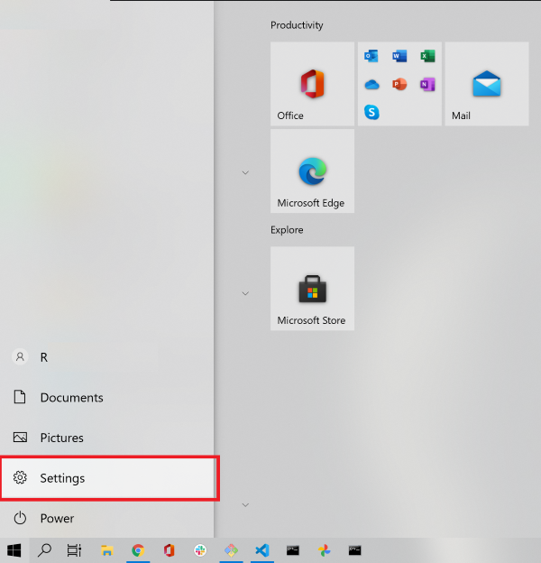
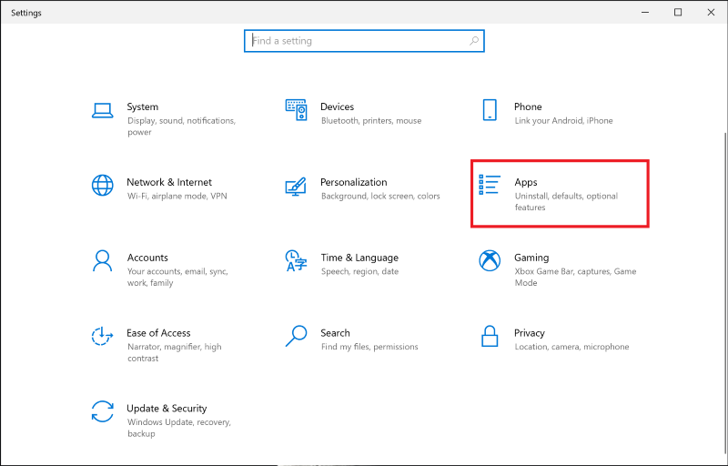

## Allow Windows 10 to Install Apps From Anywhere

1. You may be warned to use a "Microsoft-verfied" App from the Microsoft Store. This is because Keyman is not available in the Microsoft Store.
If "**Change my app recommendation settings**" is shown, select that and go to step 4.

2. If that is not available Open the Windows 10 start menu and select **Settings**

3. Click on the **Apps** in the **Windows Settings** menu

4. In the **Apps & Features** Section go to **choose where to get apps**, click on the dropdown menu below and select "Anywhere, but warn me before installing an app that's not from the Microsoft Store" or one of the other options that allows you to install from *Anywhere*.

5. Now continue installing by double-clicking on the Keyman file identified in Step 1 of [How To - Download and Install a Keyman](../start/download-and-install-keyman).

## Allow Windows 11 to Install Apps From Anywhere

1. You may be warned to use a "Microsoft-verified" App from the Microsoft Store. This is because Keyman is not available in the Microsoft Store.
If "**Change my app recommendation settings**" is shown, select that and go to step 4.

2. If that is not available, open the Windows 11 start menu (Windows logo) and select **Settings**.

3. Click on the **Apps** in the **Windows Settings** menu

4. Click on **Advanced app settings** from the option **choose where to get apps**, click on the dropdown menu below and select "Anywhere, but warn me before installing an app that's not from the Microsoft Store" or one of the other options that allows you to install from *Anywhere*.

5. Now continue installing by double-clicking on the Keyman file identified in Step 1 of [How To - Download and Install a Keyman](../start/download-and-install-keyman).

## Related Topics

-   [How To - Download and Install a Keyman](../start/download-and-install-keyman)
-   [Software Task - Uninstall Keyman](../basic/uninstall)
